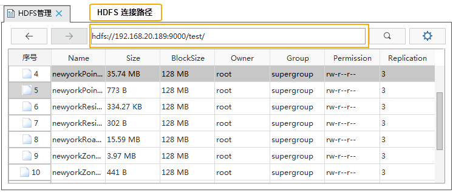

With SuperMap iDesktop, you can access the Hadoop distributed file system and interact with HDFS data. The operations that can be performed on the file system includes: reading and getting files, creating directories, deleting, downloading and uploading data and view transferring status instantly through the task manager, in the meanwhile, if the transferring is interrupted suddenly, its status will be recorded and the transferring task will recover automatically as the application is restarted.

### Data management  
    
 Go to "Online" and select the "Data Management" in the "Manager" group to open the **HDFS Management** window.
  
1. First, connect the required HDFS file system: fill in the HDFS path like hdfs://{ip}:9000, and then click on  button or press Enter key. If the address you entered is incorrect, the system will give you a prompt. 
  
     
2. After the connection is successful, iDesktop will read and get all files under the address and then display them as a list of files, and allow people to download, delete, rename them.
  
- **Download**: to download a file, you can choose it from the file list and then select "Download" in the context menu to open the "Download" dialog box where you can set a new name and specify a new path for the file.
- **Delete**: Select one or more files or folders, and then choose "Delete" from the context menu and the selected files or folders will be deleted.
- **Rename**: The existing files or folders can be renamed. Select one file or folder and then click "Rename" in the context menu.
  
3.**Generate meta file**: The .meta files corresponding with csv files in the file system can be generated for recording meta information of csv files. When you use csv data to perform distributed analysis service, the corresponding meta file must be in the same folder as csv data.
   
Choose one CSV file from the file list, and then select "Generate meta file" to open the "Generate meta File" dialog box where you need to set following parameters.

 -   Type: Specify the type of objects in your csv file.
 -   Storage Type: provides two types: WKT, XYColumn.
 -   Encode Type: specify an encode type for the result meta file, but the settings is effective only when previewing the meta file and is not saved in the meta file.
 -   Coordinate System Name: specify a coordinate system for the meta file.
 -   First Row as Field Info: checking it means the first row of the original CSV file will be used as all field names, otherwise the first row will be attribute values. But if your CSV file has specified field information, iDesktop will read and get it automatically.
 -   Field Settings: In this area, you are required to set field information (names and types) because CSV file does not have field information. Field information can be saved in a meta file for further distribution analysis. 
	 
Following picture shows one of generated .meta file.
   

 	  
  
### Upload data  
  
Go to "Online" and select the "Upload Data" in the "Manager" group to open the **Select File** dialog. Select the file you want to upload.

### Download data  
   
Currently selected files in HDFS file list can be download by clicking "Download Data" in the Manager group or in the context menu.

### Task management      
  
When the program begins to download or upload data, the "HDFS Task Management" dialog box will pop up and you can view the task progressing and you are allowed to pause or delete tasks. 
   
### New folder  
  
You can create a new folder in the current HDFS file system by clicking "New Folder" in the "Manger" group. 

### Recover task

If the transmission interruption happens because of a power outage, the program unexpectedly quits and so on, the program will record the transmission status, and after you restart it, click "Online" > "Manager" > "Recover Task" to open the "Recover Task" dialog box where you can specify the task to continue uploading or downloading.

###  Related topics

　　 [Data preparation](DataPreparation.html)

　　 [Density analysis](DensityAnalysis.html)

