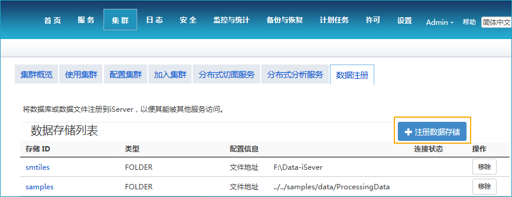

### Connect iServer service  

To perform online analysis successfully, you are required to start the iServer service first and ensure that the service can be used normally. iDesktop will record all service addresses that have been connected successfully. You can choose the one you need from iServer URL drop-down list, and then iDesktop will connect the service automatically, or you can create a new connection.

  - iServer URL: specify the IP address of the started iServer service like: 192.168.58.1:8090.
  - Username/password: specify the username and password of iServer manager.

### Input data  

　　Methods for inputting data to perform online analysis contain: **HDFS**, **iServer Catalog**. About how to prepare data, please refer to [Data preparation](DataPreparation.html).

#### HDFS

　　If you want to use data in HDFS, set Input Type to HDFS and click on Browse button to open the "Select File" dialog box, in which, you are required to enter a HDFS data address and then choose csv files as needed from the file list. 
 
  1. A variety of data can be saved in HDFS like points, lines, polygons and so on, however, only point data can be analyzed by iServer currently. 
  2. There must be a meta file corresponding to the csv file which will participate in the analysis. And so, when the prompt dialog box pops up to tell you there is not a meta file, please click on the "OK" button to create one. 

#### iServer Catalog

　  You can set Input Type to iServer Catalog, and then in the Dataset drop-down list, all datasets which can be used for online analysis will be listed.
   You are allowed to register and import new data through two ways: **Register Data**, **Import Data** for online analysis.

1.**Register Data...**: Click on the button to head to the iServer data registration page where you can register data. New registered data will be managed under the sharefile resource. About how to register data, please refer to [data preparation](DataPreparation.html).      
  
   

2.**Import Data...**: Click on this button to head to the iServer datacatalog relationship page where you import data. **Note**: To import data successfully, you need to configure iServer Datastore into the current iServer service.
  
   

  - Under the relationship / dataimport resource, you can upload datasets. The supported file types include: UDB datasource, CSV file, workspace, Excel file, and GeoJson file, and the udb datasource and workspace need to be compressed to * .zip format.
  - Uploaded datasets can be found in the list under relationship/datasets resource. 

3.You can choose a dataset from the Dataset drop-down list where data input successfully are shown in.