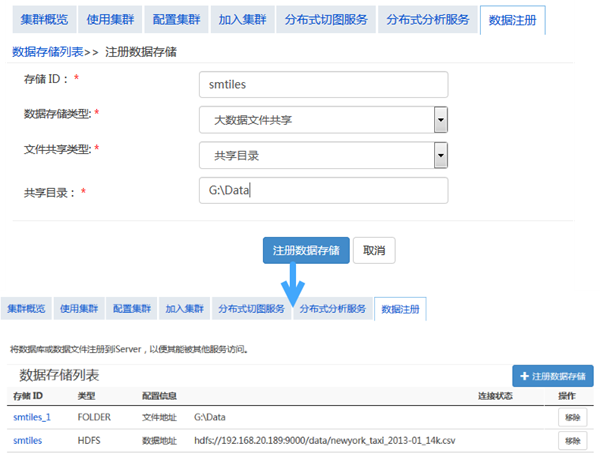
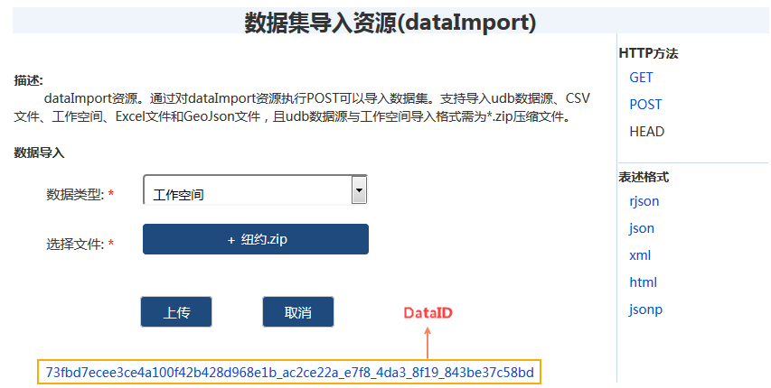
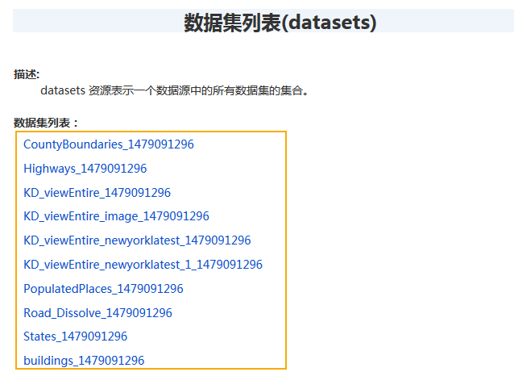

　　Big data online analysis service supports two kinds of data including HDFS and iServer catalog, of which, iServer catalog data is stored in two types: big data sharing catalogs and sptial databases. After data is ready, iServer will automatically list all datasets meeting analysis conditions when creating analysis tasks.

- Big data sharing catalog: data in local sharing directories or HDFS directories can be registered and the data type can be csv or udb.
- Spatial database: the database could be HBase, Oracle, PostgreSQL, PostGIS, MongoDB.

### Register data in iServer

　　You can register your databases or directories where your data is located in iServer thereby services provided by iServer can access and use your data. 

　　In the iServer Manager page (http://supermapiserver:8090/iserver/manager), click "Clusters" > "Data Registration" and then register databases or sharing directories to iServer.

- **Register data file sharing**: Sharing directories, local file directories or HDFS directories can be registered to iServer, and then csv files, index files, udb datasets and sub-folders can be used for distributed analysis services.
- **Register spatial database**: Remote database services like HBase, Oracle, PostgreSQL, PostGIS, MongoDB are allowed to register to iServer for saving spatial data and distributed analysis service. **Note**, the registered MongoDB services can only be used for the overlay analysis or single object spatial analysis in distributed analysis service.

##### Registering data file sharing

　　iServer Distributed Analysis Service provides data processing and analysis capability for csv and udb data. You can register a local directory, a sharing directory or HDFS directory into iServer. Following contents describe relevant operations in detail.

1. In the iServer Manager page (http://supermapiserver:8090/iserver/manager), click "Clusters" > "Data Registration" > "Register data storage" and then set "Data storage type" to "Big data file share".
2. Shared data type can set to:

   - Share directory: csv data or udb data saved in a local folder or a sharing folder can be registered to iServer for distributed analysis. The data types of registered csv data can be modified.
   - HDFS directory: For a better effect of using massive data in GIS application, we suggest you use HDFS (Hadoop Distributed File System). It has high fault-tolerance character and is suitable for the big data application. 

3. Enter the sharing path of your data into the "Shared file directory" text box or the "HDFS directory".
4. Click "Register data storage".

##### Register a spatial database

　　In the iServer Manager page (http://supermapiserver:8090/iserver/manager), click "Clusters" > "Data Registration". All registered data is listed in the Data Storage List, and you can click each Storage ID to view relevant configuration information.

　　Specific configuration information includes:

- Storage ID: a unique identifier created for each database.
- Data storage type: select "Spatial database".
- Database type: You can choose any one from HBase, Oracle, PostgreSQL, PostGIS, and MongoDB.
- Service address: an address for database connection.
- Database name: the name of your database to use.
- Username: The username owning the database (except HBASE).
- Password: The password of the database (except HBASE).
- Allow to edit: Only works on the registered HBase, PostgreSQL, POSTGIS databases. Only checking it, the related database can be as a storage node of uploaded relation data and the storage node follows the rules below:

   - If there are multiple editable databases, the database with the least datasets will be as the storage node preferentially.
   - If both the registered database and iServer DataStore are editable, the database will be as the storage node.
   - If only iServer DataStore is registered, it will be as the storage node.

　　**Note**: If iServer service and HBase cluster are not located in the same machine, you need to add ip of each machine where each HBase cluster node is located in into the hosts file of the machine where iServer service is located in.

　　You are allowed to register spatial databases through adding following information into the configuration file iserver-datacatalog.xml:

    <datastore> 
    <datastoreType>SPATIAL</datastoreType> 
    <name>postgresql2</name>
    <type>POSTGRESQL</type>   
      <connectionInfo>  
        <dataBase>postgres2</dataBase>   
        <engineType>POSTGRESQL</engineType>   
        <password>iserver</password>   
        <server>192.168.17.116</server>   
        <user>iserver</user>   
        <connect>false</connect>   
        <exclusive>false</exclusive>   
        <openLinkTable>false</openLinkTable>   
        <readOnly>false</readOnly>  
      </connectionInfo> 
    </datastore> 
 
　　The parameters "datastoreType", "name", type are required to set. In the conectionInfo: the parameters "dataBase", "password", "server", "user" are required to set as well.

### iServer DataStore

　　New application program DataStore is provided, you can create data storage quickly through iServer DataStore, and associate data storage with iServer. When configuring relational data storage in DataStore, a PostgreSQL database will be created automatically which is used to store dataset. Through iServer big data service, you can download, upload data, and analyze data.

##### Build Environment

　　Configure a Firewall for DataStore access by default port 8020. If DataStore is installed in Windows, please confirm whether vcredist 2013 is installed, if not, the installation file is at DataStore product package\support\vcredist\vcredist_x64-2013.exe.

1. Start service at d bin folder of iServer DataStore product package.
2. Access DataStore configuration guide by entering address: http://{ip}:8020, then input iServer username and password.
　　
3. Specify contents directory which is used to store data, log and backup file. Default is [DataStore installation directory]\data. Note: path which includes Chinese characters or spaces is not supported on DataStore content directory.
　　
4. Select data type to be created, including: relational data, binary file, slice cache, spatial data. For binary file and tile data, you need to install MongoDB. After selecting binary storage data or slice data storage of creating style, specify MongoDB installation path, such as: D:\mongodb.
5. Click OK.
6. After configuring successfully, a prompt that relational component of iServerDataStore has been configured to iServer successfully will be shown in "Configuration State" page, click on "Data Directory Service", after login successful, click "dataimport" to upload data.
　　 
7. Select corresponded data and click on "Upload" button to upload data into DataStore. The supported file includes: udb datasource, csv file, workspace, Excel file and GeoJson file, importing format of udb datasource or workspace must be *.zip.
　　 
8. After uploading data successfully, the only dataID will be returned, which is used to represent the uploaded data package. You can view the detailed description information of the data package by clicking the DataID. The uploaded dataset will be displayed in "Dataset List" of relationship/datasets resource.
　　 
9. Open the configured iServer DataStore datasource in iDesktop to view the uploaded data.

　　 

