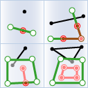
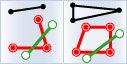

　　Joins attributes from one dataset into another dataset based on the spatial, time or attribute relationship. The datasets involved could be spatial data or attribute data. According to the specified conditions, iDesktop will determine condition-meeting  features and then join them into the target dataset.

　　The tool Feature Join can append information from one layer to another layer based on spatial, time, or attribute relationship or a group of the three relationships.

##### Spatial relations

　　First, determines the spatial relationship between features. The available spatial relations depend on the joined layer type (point, line, or region). For specific spatial relation instructions, see [Basic Spatial Query Operators](../../docs/DataProcess/SpatialQuery_BasicOperators.html)

Spatial relations  |Illustrates| Description     
 :----- |  :----: | :----  
Near |  | The distance between the joining feature and the joined feature is less than the specified radius.
Contain |  | The joining feature is within the joined object.
Within |  | The joined feature is within the joining object.
Cross |  | The joined feature and the joining feature cross each other.
Overlap |  | The joined feature and the joining feature have some overlaps.
Intersect |  | The joined feature intersects with the joining object.
Touch |  | The joined feature and the joining feature have at least one boundary point in common, but no interior points.
DisJoint |  | The joined feature and the joining feature have no points in common.
Identity |  | The joined feature and the joining feature are equal in topology.

<!--##### Time relations

Time relations | Description     
 :-----  |  :---- 
**Near** | When the source time is within the specified time range of the joining time, the source time is Near the joining time.
**After** | When the source time is later than the joining time but the interval between them is within the specified range, the source time is after the joining time.
**Before** | When the source time is early than the joining time but the interval between them is within the specified range, the source time is before the joining time.
**Contain** | When the joining time is during the staring time and the ending time of the source time interval, the source time contains the joining time.
**During** | When the source time is during the staring time and the ending time of the joining time interval, the source time is during the joining time.
**Finish** | The ending time from the source feature is the same with the ending time from the joining feature, but the starting time of the source feature is later than the staring time of the joining feature.
**Finished** | The ending time from the source feature is the same with the ending time from the joining feature, but the starting time of the source feature is early than the staring time of the joining feature.
**Meet** | 源时间与连接时间间隔在同一时间开始，且源时间在连接时间之前开始，在连接时间间隔终点之前结束。
**Met** | 源间隔时间与连接时间在同一时间开始，且源时间在连接时间之后开始，在连接时间之后结束时。
**Overlap** | 源时间间隔在连接时间间隔的起点前开始，连接时间终点前结束，则源时间与连接时间重叠。
**Overlapped** | 源时间间隔在连接时间间隔的起点后开始，连接时间终点后结束。
**Start** | 源时间与连接时间间隔在同一时间开始，且源时间在连接时间间隔终点之前结束。
**Started** | 源时间与连接时间间隔在同一时间开始，且源时间在连接时间间隔终点之后结束。
**Equal** | 两个时间的起始时间或间隔完全一致，则这两个时间完全相同。-->

##### Applications

- Analyze the flow of funds transactions and count the sum of the amounts remitted to the same account within the specified time.
- With the tool, additional information of various jurisdictions (such as school districts, police districts, communities, etc.) can be added to each crime to further study and analyze the impact of crime on different jurisdictions.

##### 　　Functional Entry

　　There are two functional entries.

- In the "Online" tab and "Analysis" group, select "Feature Join".
- In the "Model Builder" tab click "New" to open the "Toolbox" panel then click "Feature Join" under the "Online Analysis", or drag it into the "Model Builder" window. Double click the function node to open the "Parameter Settings" panel.

##### Parameters

1. **iServer URL**: choose an address for iserver login. For specific instructions, please refer to [data input](DataInputType.html).
2. **Source dataset**: specify the dataset which will be used for the funtion. How details on how to set the source data, please refer to [Data Input](DataInputType.html).
3. **Join Data**: Required. Specify the dataset which will provide attributes. The supported data type can be point, line or region.
4. **Join Type**: Required. Specify the correspondence between the joined feature (the source object) and then joining object.
   - **Join one to one**: If there is at least one source feature can be joined by more than one joining features, only the number of joining features relative to each joined feature will be recorded in the result, otherwise, attributes of joining features will be appended into corresponding source data.
 
   - **Join one to many**: Saves attributes of all joining features matching the specified conditions into result . As the following pictures showing, there are three field values France in target data are matched with the one in source data, and so all of the three joining field values are kept in result data.
　　

5. When you want to specify data relationships, you are allowed to select one or two or all of the following three relationships for the analysis.
  - **Spatial Feature Join**: The selection of spatial relations is dependent on the geometrical type (point, line, region) of layers involved in the analysis.
  - **Time Feature Join**: The selection of time relations is dependent on the time type (moment or interval) of layers involved in the analysis.
  - **Property Feature Join**: Determines attribute relations between joined features and joining features, like whether a field value from the joined feature is equal (unequal) to the corresponding field value of the joining feature, and then appends the field value matched the condition.

6. **Property Statistics Field**: Calculates statistics for all field values meeting conditions. If you specify multiple fields, the same number of property statistical methods should be specified as well.
7. **Property Statistical Methods**: Select one operate for calculating statistics for statistical fields.
5. **Time Distance Unit**: Second is by default.
8. **Tolerance**: The parameter only works on the spatial distance in the spatial relation "Near", for example, if the spatial distance is 100 meters, and the tolerance is 1, then joining objects which are 99 meters or 100 meters distance from the source objects match the condition.

##### Analysis result

　　Click "Execute" to perform the feature, and the result will be opened automatically on the map window and its path will be output in the output window.

###  Related Themes

　　 [Environment Configuration](BigDataAnalysisEnvironmentConfiguration.html)

　　 [Data Preparation](DataPreparation.html)

