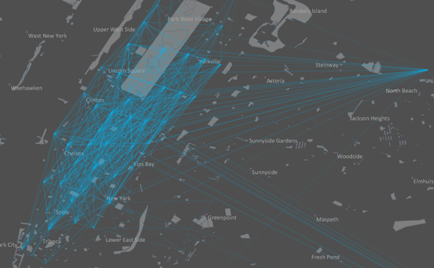

title: OD line Make Analysis
---

　　The OD Line(Origin-Destination Line) is one kind of lines connecting two points (which can be regarded as one starting point and one ending point) of features and is commonly used for expressing the relationship between two points like flight routes, traffics, fund flow and so on. The tool OD Line Make Analysis means constructing OD lines based on the staring positions and ending positions of input features. 

　　The tool can be used for following scenarios:
- Providing data for transit network to improve it by determining passengers' distribution with this feature.
- Providing basic data for urban comprehensive traffic system planning and estimate.
- Providing basic data for analyzing and predicting goods happening (like the amount of deliverymen, goods) and distribution (like where goods will be delivered) by constructing OD lines for goods flow.

##### 　　Function entrances

　　Two entrances are provided:

- In the "Online" tab and "Analysis" group, select "OD line Make Analysis".
- In the "Model Builder" tab click "New" to open the "Toolbox" panel then click "OD line Make Analysis" under the "Online Analysis", or drag it into the "Model Builder" window.

##### 　　Parameters

　　To perform an OD line Make Analysis correctly, following parameters are required to set.

1. **iServer URL**: Log in iServer first, for detail operations, please refer to [Data Input](DataInputType.html).
2. **District Region Dataset**: Specify a dataset for constructing lines.
- **OD Dataset**: Required. You need to specify an OD table dataset which must be a tabular dataset.
- **District Region Name Field**: Required. It is used for distinguishing different administrative regions.
- **Coordinate Fields**: Required. Specify two fields identifying X-coordinates and Y coordinates for all starting points and then specify two fields for ending points.
- **Property Statistics Field**: Optional. You are allowed to specify a non-system field in integer, long, float.
- **Property Statistics Model**: Optional. The supported statistical modes include: MAX, MIN, SUM, RECORDCOUNT, AVERAGE, VARIANCE, STDDEVIATION.
- Click "Execute" to perform the analysis, and the result will be opened automatically on the map window and its path will be output in the output window. Following picture is OD lines constructed by the positions getting into taxis and getting off them.

