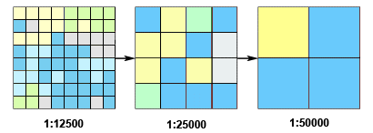

### Concept
   Image pyramids are images collections with decreased resolution. Through subsampling images, a series of image layers with different resolutions are built, and each layer is saved independently then corresponding to a spatial index to improve display efficient when zooming images. In order to reduce the amount of image transmission and optimize display performance, it is better to build an image pyramid.

### Theory
   
   Image pyramids are image collections produced according to a certain rule. The higher the image resolution, the more levels the created image pyramid has. For a image with resolution is 2^a×2^b (a&gt;b), SuperMap will create a image pyramid with (b-6)+1 levels. The resolution of the following picture is 512×512,  hence the created image pyramid has four levels that resolutions is 512×512, 256×256，128×128 and 64×64.

  

   After creating an image pyramid for an image, the system will acquire its image pyramid to display data each time the image is viewed. When you zoom in or out, the system will automatically select the most appropriate pyramid level based on the user's display scale to display this image.

　　Creating an image pyramid must be based on an original image and only one image pyramid can be created for an image dataset.  If you want to create a new image pyramid, you must delete the existed one first. When you browse a raster dataset with an image pyramid, you browse the image pyramid created in reality. Follow picture shows the procedure of creating an image pyramid.
  
   
   The creation of an image pyramid makes the rendering performance and efficient obtain greatest improvement, while increasing the storage space, in other words, your datasource file is grown. For a huge amount of image data, even though creating an image pyramid will spend a long time, but it is a good way to save more time when browsing the image data.

　　SuperMap SIT is a data format integrating the image compression and highly efficient image pyramid technologies. And so, image data can be displayed very fast and smoothly even in a computer with lower configuration. 

### Management of image pyramids

　　You can create an image pyramid or delete an existed image pyramid.

#### Create image pyramids

　　Image datasets supporting creations of image pyramids include: image datasets, raster datasets and raster files (currently supportive formats: tiff, tif, img) opened as datasources. SuperMap provides following two methods to create image pyramids.
* **Way 1**: Click the "Start" tab > "Data Processing" group > "Image Pyramid" to open the "Image Pyramid Manager" dialog box where you can add datasets then create image pyramids in bulk.
* **Way 2**: Right click your image or raster dataset, and select "Build Image Pyramid", then the program will create an image pyramid automatically. **Note**: If you select multiple datasets, and by this way to create image pyramids for them, all formats of the datasets must be the same. 

#### Delete image pyramids

   You can delete image pyramids of image or raster datasets. However, for image files opened as datasources, their image pyramids can not be delete. There are two ways to delete image pyramids.

* **Way 1**: Click the "Start" tab > "Data Processing" group > "Image Pyramid" to open the "Image Pyramid Manager" dialog box where you can add datasets then delete image pyramids in bulk.
* **Way 2**: Right click your image or raster dataset, and select "Delete Image Pyramid", then the program will delete the image pyramid automatically. **Note**: If you select multiple datasets, and through this way to delete their image pyramids, all formats of the datasets must be the same.

