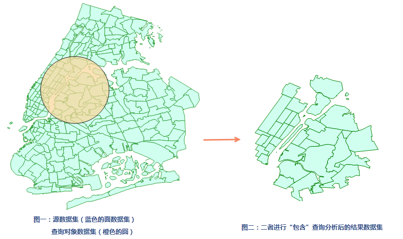

　　The spatial query is one kind of searching way which can construct filter conditions based on the spatial positions between geometrical objects.
 
   iDesktop provides 8 relation operations. For specific instructions, see [Basic Spatial Query Operators](../../docs/DataProcess/SpatialQuery_BasicOperators.html)
  
   The single object spatial query in distributed analysis services refers to perform spatial query on a source dataset with only one object from the query dataset. If there are multiple objects in the query dataset, the object with the minimum SmID value will be used as the single object.

##### 　　Functional Entry

　　There are two functional entries.

- In the "Online" tab and "Analysis" group, select "Overlay Analysis".
- In the "Model Builder" tab click "New" to open the "Toolbox" panel then click "Overlay Analysis" under the "Online Analysis", or drag it into the "Model Builder" window. Double click the function node to open the "Parameter Settings" panel.

##### 　　Parameters

　　All parameters of the tool Single Object Spatial Query can be divided into four classes: iServer, source data, query data and analysis parameters, for the first two classes of parameters, see [Data Input](DataInputType.html). Following contents detail all parameters in the last two classes.

1. **Query Data**: Required. Refers to the dataset where the query object is located. Only the single object query is supported. If there are multiple objects in the query dataset, the object with the smallest SmID will be used as the single object.

2. **Analysis Parameters**: Different spatial query modes have different requirements for the type of source and query datasets.
   
	- Identity, Disjoint, Contain, Intersect, Touch, Within: both of the source dataset type and the query dataset type could be point, line, or region.
	- Cross: The source dataset type must be line and the query-object dataset type can be line or region. 
	- Overlap: The source dataset type could line or region and must be the same with the query-object dataset type.
3. Click "Execute" to perform the analysis, and the result will be opened automatically on the map window and its path will be output in the output window.

　　

###  Related Themes

　　 [Environment Configuration](BigDataAnalysisEnvironmentConfiguration.html)

　　 [Data Preparation](DataPreparation.html)

