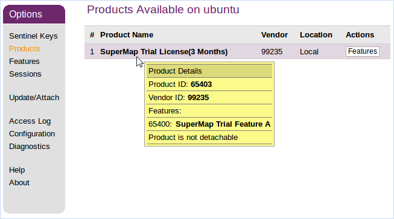

　　在启动SuperMap iDesktop Java之前，需要进行许可配置，在 Linux 操作系统下，支持软许可和硬件许可，但都必须安装驱动程序，所有的许可验证都是通过驱动的方式进行通信。

## 安装许可驱动

　　安装许可驱动需要以　root 身份进行，解压　SuperMap iDesktop Java　的　tar　包之后，在根目录的　support\SuperMap_License\support\aksusbd-2.4.1-i386　目录下进行安装即可。

　　进入上述目录后，通过以下命令即可执行许可驱动的安装：

    $ ./dinst

　　或者

    $ sh dinst

　　安装完许可驱动后就可获得90天的试用许可，即可使用 SuperMap GIS 系列产品。如果 通过dinst命令没有可执行权限，请授予执行权限，执行如下命令：

    $ chmod +x dinst

　　在 Linux 64位操作系统上安装 SuperMap License Center 许可驱动程序时，有的会出现：“The 32bit support is missing…”错误，是因为该 Linux 64 位操作系统缺少 32bit 支持库，所以运行会出错。解决方法是需要手动安装支持32位的支持库，缺少的支持库如下所述。您可以加载系统盘的补充安装相关库，也可以到相应系统的官网上获取相关库来安装。

-   libc6-i386 和 ia32-libs（Ubuntu）

-   libstdc++-devel.i686、glibc.i686、libgcc.i686、libstdc++.i686、glibc-devel.i686（RHEL、CentOS、OpenSUSE、SLES 和 OES）

-   glibc-32bit（OpenSUSE、SLES 和 OES） 

### 1 试用许可

　　(1) 生成运行报告

　　在包的根目录下执行如下命令，并指定运行报告的存放路径：

    $ ./licensetool.sh -report /路径名/\*.report

　　命令运行后将在指定的路径下生成 \*.report 文件。

　　(2)申请试用许可

　　您可以直接在北京超图软件股份有限公司官网上的“SuperMap技术资源中心”申请试用许可，申请后您将获得：

-   如果申请的是 SuperMap GIS 7C 系列产品的许可，您将获得 一个\*.lic7c 格式的许可文件；

-   如果申请的是 SuperMap GIS 8C 系列产品的许可，您将获得 一个\*.lic 格式的许可文件。

　　(3) 试用许可生效

　　您可以通过以下两种方式使申请的试用许可生效：

　　方式一：将获得的试用许可文件放在操作系统的opt目录下，具体为：/opt/SuperMap/License/。请注意为该目录授予读写权限。系统会自动使用该目录的许可文件，无须其他配置。

　　方式二：进入SuperMap iDesktop Java 包的根目录，将您获得的 \*.lic 或 \*.lic7c 试用许可文件指定到文件位置，执行以下命令：

    $ ./licensetool.sh -update /路径名/\*.lic

　　或

    $ ./licensetool.sh -update /路径名/\*.lic7c

### 3  正式许可

#### 3.1  配置软许可

　　SuperMap 许可中心目前提供的软许可配置方式为软件激活，不同于 Windows 操作系统下的界面化配置，在 Linux 操作系统下是通过./licensetool.sh 命令，来完成软许可配置。

　　进入软件包的根目录，执行如下命令，可以查看配置软许可的相关命令：

    $ ./licensetool.sh

　　进入软件包的根目录，使用“软件激活”的方式配置许可，步骤如下：

　　(1)获取本机信息，执行如下命令，并指定生成的本机信息文件所存放的路径，再指定的路径下生成\*.c2v 文件。

    $ ./licensetool.sh -create /路径名称/\*.c2v

　　(2) 将本机信息提交给“北京超图软件股份有限公司”。

　　将上一步骤生成的本机信息文件（\*.c2v）提交给北京超图软件股份有限公司，我们将根据您的申请生成\*.v2c许可文件并返回给您，您通过该文件配置正式许可。

　　(3)将您获得的\*.v2c 正式许可文件指定到文件位置，执行如下命令：

    $ ./licensetool.sh -update /路径名称/\*.v2c

#### 3.2 配置硬件许可

　　在您进行许可配置之前，请确保已经获得北京超图软件股份有限公司的授权许可。如果在同一网段内已经配置了许可服务器，则许可会自动配置，不需要再进行手工配置；如果当前网络环境中（其他网段）存在可用的硬件锁许可，请按照以下步骤进行许可配置：

　　(1) 打开浏览器，访问 http://localhost:1947 或 http://本地 IP:1947。

　　(2) 在左侧 Options 中选择 Configuration。

　　(3) 在右侧选择 Access to Remote License Managers 选项卡。

　　(4) 在 Specify Search Parameters 填入其他网段的许可服务器 IP，点击 Submit。

　　(5) 稍等几分钟就可以在左侧 Options 中的 Sentinel Keys 选项下看到该服务器的加密锁了。

　　许可状态的查询也可以通过在SuperMap iDesktop Cross包的根目录下，执行如下命令进行查看：

    $ ./licensetool.sh -s

### 4 管理许可信息

  通过许可管理，您可以查看许可状态，更新许可，许可借入/借出，许可归还等。

#### 4.1 查看许可状态

　　许可状态的查询可以通过在产品根目录下执行如下命令进行查看：

    $ ./licensetool.sh  -s

　　许可状态信息依次为产品ID、模块ID、产品名称、许可类型（包括正式版和试用版）、许可个数，以及许可过期时间。

#### 4.2 许可更新

　　将您获得的\*.v2c正式许可文件指定到文件位置，执行如下命令：

    $ ./licensetool.sh  -update /路径名/\*.v2c

　　许可更新可以接受以下几种文件，用于不同的目的：

-   许可激活文件(\*.v2c)，用于在当前计算机激活购买的正式许可，需要先获取本机信息以生成许可激活文件。

-   7C文件许可(\*.lic7c)，用于更新当前计算机中7C系列产品的试用许可，需要先生成当前计算机的运行报告。

-   文件许可(\*.lic)，用于更新当前计算机中8C、9D系列产品的试用许可，需要先生成当前计算机的运行报告。

-   许可借出凭证(\*.h2r)，用于将网络软许可中的一个许可借出到当前计算机。

-   许可归还凭证(\*.r2h)，用于将借出的许可提前归还到当前的许可服务器，由借入许可的计算机生成。

#### 4.3  许可借入/借出

　　1.  生成借入信息文件(\*.id)

　　在需要借入许可的服务器上运行如下命令，生成本机的借入信息文件(\*.id)：

     $ ./licensetool.sh –id \*.id

　　2.  设置允许许可借出

　　在许可借出的服务器上设置允许许可借出：

-   打开浏览器，访问 http://localhost:1947 或 http://本地 IP:1947；

-   在左侧 Options 中点击 Configuration，进入配置页面；

-   在页面右上方点击 Detachable License，打开借出许可的配置页面；

-   勾选 Enable Detaching of Licenses，即可允许许可借出；

-   您还可以根据实际情况设置许可借出的限制，如最长借出时间（Max. Detach Duration）等。

　　3.  生成许可借出文件

　　在借出许可的服务器上运行如下命令，生成借出凭证文件：

        $ ./licensetool.sh -detach  \[daycount\] \[productid\] \[idfile\] \[h2rfile\]

　　示例：（借出2天，产品ID为1，借入许可的服务器信息文件server1.id，生成借出凭证文件 mylicense.h2r）

        $ ./licensetool.sh -detach 2 1 server1.id mylicense.h2r

　　其中:

-   daycount 为需要借出许可的天数，不能超出最长借出时间；

-   productid 为借出的产品ID，您可以通过 http://localhost:1947，在 Products 页面将鼠标放在想要借出的产品上查看产品ID；

　　

-   idfile为需要借入许可的服务器的信息文件（\*.id）

-   h2rfile为生成借出凭证文件（\*.h2r）

　　4.  配置使用借到的许可

　　借入许可的服务器获取到借出凭证文件（\*.h2r）后，需要执行更新许可命令：

    $ ./licensetool.sh –u \*.h2r

#### 4.4 许可归还

　　在借入许可的服务器上运行如下命令，获取归还凭证文件（\*.r2h）：

    $ ./licensetool.sh –cd KeyID canceldetachfile

　　KeyID 可用 infofile 命令获取许可信息文件，在 infofile 命令后指定信息文件生成的目录位置：

    $ ./licensetool.sh –infofile /路径名/

　　执行上述命令后，在指定的目录下会生成后缀为 .xml 的许可信息文件，其中参数为&lt;attached&gt;true&lt;/attached&gt;为可归 keyID。

　　在许可服务器上面运行许可更新命令，完成许可归还。

    $ ./licensetool.sh –update \*.r2h

　　通过查看许可状态命令可看到许可总数自动加1。

    $ ./licensetool.sh –status

## 云许可

　　云许可可通过 SuperMap Online 账户进行申请和购买，只要在 SuperMap iDesktop Java 中登录 Online 账户，即可激活并使用云许可。

　　云许可中包含两种用户角色：许可管理员用户和普通用户，二者都需要通过 SuperMap Online 注册。

- 许可管理员用户为购买了产品并获得产品序列号的账户，负责向自己或其他用户分配许可、回收许可等。 
- 普通用户为许可的使用者，不具备许可管理权限。 

### 应用场景

　　云许可不仅实现了随时随地使用许可，也为用户使用许可、管理许可带来了很大便利，在以下场景中，云许可能较好的发挥优势：

- 对于GIS服务器较多，且分布在不同地区的应用系统来说，使用云许可，能够实现所有许可统一监控、管理与分配。此外，当某一台机器发生故障时，能够迅速将许可转移至其他机器上继续使用，以减少损失。 
- 随着GIS服务需求的不断增加，对于服务器来说，就需要获取更多功能的许可，为用户提供更多服务。服务器配置许可的过程中，相比传统方式更新许可，云许可提供了更便捷、快速的许可激活与更新方式。 

#### 购买正式云许可

　　需要先获取产品序列号，许可管理员根据序列号对其中的许可进行分配。您可以通过与北京超图软件股份有限公司签订购买合同，获取序列号。也可以通过超图在线商店自行购买产品并获取序列号。 

　　通过超图在线商店获取云许可的步骤如下：

1. [注册或登录](http://sso.supermap.com/register?service=http://www.supermapol.com)超图 [SuperMap Online](http://www.supermapol.com)；
2. 点击“购买”→"9D/8C/7C限时许可"→“面向桌面用户” ，选择将购买的产品及版本，例如 SuperMap iDesktop 9D 高级版，点击右侧箭头进入购买界面；
3. 选择许可时间、许可数量、许可类型选择“限时云许可”，添加扩展模块 ；
4. 查看右侧“许可清单”确认选择无误后，点击“立即购买” ；
5. 填入“最终用户信息”，并选择支付方式，点击“保存并支付” ；
6. 购买完成后可在 SuperMap Online 首页中进入“个人中心”，“云许可管理” ；
7. 选中将分配的许可，点击“分配许可”，输入普通用户的邮箱 ；
8. 获得许可的账户，可以在SuperMap Online 首页中进入“个人中心”，查看可用云许可，并且可以在 SuperMap iDesktop 中登录使用许可了。 **注**：许可管理员给自己分配许可后，也可在 iServer 中登录使用许可。

#### 获取试用云许可

1. [注册或登录](http://sso.supermap.com/register?service=http://www.supermapol.com)超图 [SuperMap Online](http://www.supermapol.com)后，单击用户名右侧的下拉按钮，选择“账户信息”→“[账号管理](https://sso.supermap.com/account/manager/manager.do?manager=accountInfo)”，单击“立即绑定”绑定手机号之后，即可获取90天的试用许可。

#### 使用云许可

　　购买云许可的正式许可之后，可在启动桌面时弹出的“许可授权”界面中，登录 SuperMap Oline 的帐号，即可自动识别到帐号中的许可信息。

#### 查看云许可信息

　　进入 iServer 管理页面，点击上方“许可”，可查看到云许可状态、已配置的许可、许可状态、模块可用状态、附加信息等。
