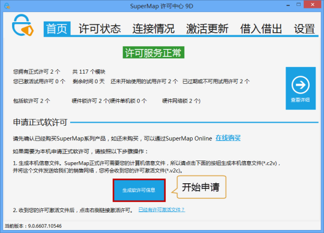
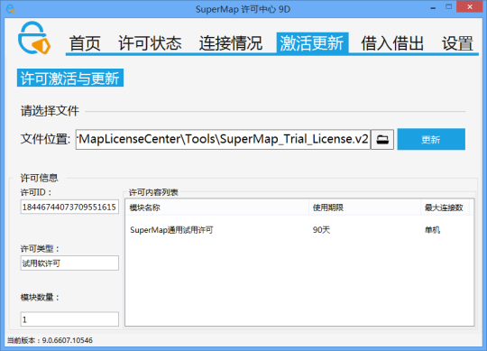
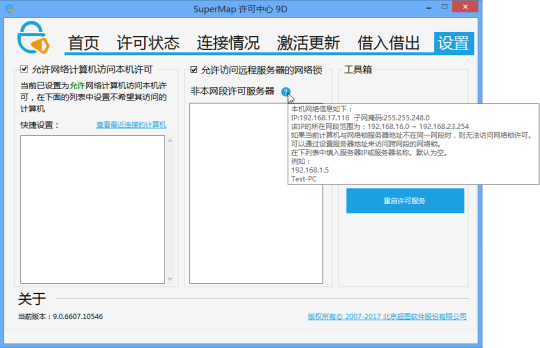
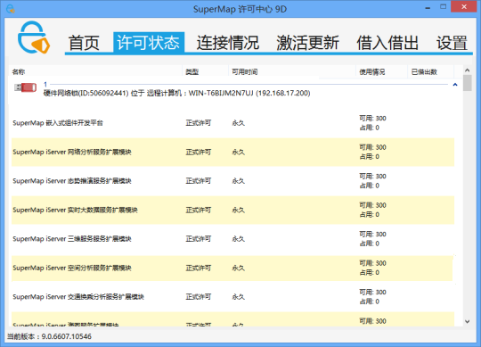
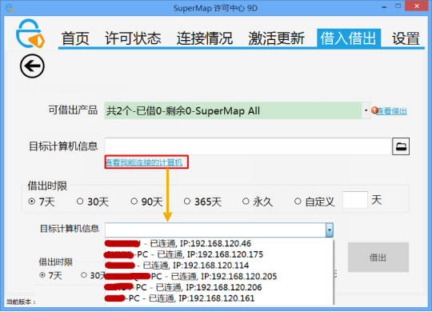
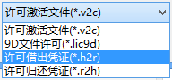

　　本文主要介绍Windows平台中配置许可的过程。

### 1 获取 SuperMap 许可中心

　　在 Windows 平台上，通过 SuperMap 许可中心（SuperMap License Center）来管理 SuperMap GIS 产品的许可，通过它可以配置许可信息、管理许可信息、以及查看目标机器上详细的许可状态和使用情况。

　　SuperMap 许可中心以多种形式提供，您可以通过以下任意一种方式获取：

- SuperMap iDesktop Java 产品包中提供了 SuperMap License Center 许可工具，位于%SuperMap iDesktop Java_HOME%\support\SuperMapLicenseCenter 目录下。 
- [下载 SuperMap License Center](http://product.supermap.com.cn)（Windows 32 位）在线安装工具（LicenseCenterOnlineSetup.exe），双击运行 LicenseCenterOnlineSetup.exe 安装最新版本的 SuperMap 许可中心。 
- 访问SuperMap [技术资源中心](http://support.supermap.com.cn)，下载 SuperMap License Center 的 Zip 包（SuperMapLicenseCenter.zip），将 Zip 包解压即可用。 

　　通过上述方式获取 SuperMap 许可中心后，通过运行上述目录下的 SuperMap.LicenseCenter.exe 或 SuperMap.LicenseCenter(for .NET 4.0).exe 文件即可启动许可中心。

**注意**：

- 在 Windows 8.1/Windows 8/Windows Server 2012 R2/Windows Server 2012 操作系统上，可双击 SuperMap.LicenseCenter(for .NET 4.0).exe 文件启动许可中心 。
- 在 Windows 7 /Windows Vista /Windows Server 2008 R2 /Windows Server 2008  /Windows Server 2003  操作系统上，可双击  SuperMap.LicenseCenter.exe 文件启动许可中心。
- 在 Windows XP 操作系统上，需先安装 .NET Framework 3.5/2.0 ，然后再双击 SuperMap.LicenseCenter.exe 文件启动许可中心。
- 9D 系列产品许可只能通过 9D 版本的许可中心进行管理。 

### 配置许可信息

　　首次打开 SuperMap 许可中心，该程序会自动安装依赖的驱动，并默认安装一个90天的试用软许可。

##### 配置软许可

　　SuperMap 许可中心以软件激活方式配置软许可。您可以通过 SuperMap 许可中心获取本机信息，并将信息提交给北京超图软件股份有限公司来获取正式许可。获得正式许可后，只需更新到本机，就可以完成许可的配置。具体步骤如下：

1. 生成软许可信息 

　　进入 SuperMap 许可中心首页，点击“生成软许可信息”按钮，在指定的路径下生成软许可信息文件(*.c2v)。

　　

2.将本机信息提交给北京超图软件股份有限公司 

　　将上述软许可信息文件（\*.c2v）提交给北京超图软件股份有限公司，北京超图软件股份有限公司将根据您的申请生成\*.v2c 正式许可文件并返回给您，收到后请妥善保管。

3.许可生效 

　　在 SuperMap 许可中心，打开“激活更新”页，如下图所示，浏览并选择您获得的\*.v2c 正式许可文件，然后，单击“更新”按钮，即可使许可生效。

　　
　　

##### 配置硬件许可

　　在 Windows 操作系统下，单机锁和网络锁的客户端，都不需要安装驱动程序即可运行许可工具；网络锁的许可服务器端需要安装许可驱动。

　　如果当前网络环境中同一网段内已经配置了可用的许可服务器，则会自动获取和配置许可，不需要手工配置；如果需要设置来自其他网段的许可服务器，请按照以下步骤进行配置：

1. 进入 SuperMap 许可中心的“设置”页面。
2. 确认“允许访问远程服务器的网络锁”勾选框为勾上的状态 。
3. 如果确认当前计算机与网络锁不在同一网段，请在“非本网段许可服务器”列表中填入许可服务器 IP 或名称，默认为空。视网络情况，等待几秒至几分钟即可。也可以点击右侧“工具箱”中的“重启许可服务”,立即生效。 

　　

##### 申请试用许可

1.生成运行报告

　　申请试用许可前，您需要先生成本机的运行报告。进入 SuperMap 许可中心的“设置”页面，点击右侧的“生成运行报告”。将会生成后缀为.report的运行报告文件，您需要为该文件指定存放目录。

2.申请试用许可

　　您可以直接在北京超图软件股份有限公司官网的“SuperMap 技术资源中心”申请试用许可，申请后您将获得：

- 如果申请的是 SuperMap GIS 7C 系列产品的许可，您将获得 一个*.lic7c 格式的许可文件。
- 如果申请的是 SuperMap GIS 8C 系列产品的许可，您将获得 一个*.lic 格式的许可文件。
- 如果申请的是 SuperMap GIS 9D 系列产品的许可，您将获得 一个*.lic9d 格式的许可文件 

3.试用许可生效

　　在 SuperMap 许可中心，打开“激活更新”页，浏览并选择您获得的试用许可文件，然后，单击“更新”按钮，即可使试用许可生效。**注意**：8C版本的许可中心可激活 7C、8C 文件许可，9D版本的许可中心只可激活 9D 文件许可。

##### 移除试用许可

　　申请获得的试用许可支持移除，在 SuperMap 许可中心，打开“许可状态”页，在您申请的试用许可名称右侧会有一个“清除试用许可”按钮，点击“清除试用许可”按钮，该试用许可将被移除。

　　注意：产品包中自带的试用许可不支持移除。

### 管理许可信息

　　通过 SuperMap 许可中心，您可以查看许可状态、查看许可使用情况、更新许可、许可借入/借出、许可归还。

##### 查看许可状态

　　SuperMap 许可中心的“许可状态”页面，显示了目标机器上所具有的 SuperMap GIS 9D 系列产品的许可信息，信息的组织方式按照产品进行分类，每一类下面的每条记录对应该产品的一个许可模块。

　　每条许可模块记录展示了详细的许可信息，其中各个字段的具体含义如下：

- 名称：许可模块名称。 
- 类型：显示许可类型是试用许可还是正式许可。 
- 可用时间：显示该许可模块有效的起始日期。 
- 使用情况：显示该许可模块的当前状态。 
- 已借出数：显示可借出许可已经借出的数量。 

　　

##### 查看许可使用情况

　　SuperMap 许可中心的“连接情况”页面显示了 SuperMap GIS 9D 系列产品许可模块在目标机器上当前被使用的详细信息。

　　其中，记录的每个字段表达的内容如下所示：

- ID：许可模块对应的 ID 值。
- 模块：许可模块的名称。 
- 地址：许可模块的许可位置，如果是来源于本地，则显示 Local；否则显示对应机器的 IP 地址。 
- 用户：许可模块的许可所在的计算机的用户名和计算机名。 
- 进程：显示当前许可模块被使用的进程。 
- 时间：当前许可模块被连接的时间。

##### 更新许可

　　SuperMap 许可中心的"许可更新"页用来进行更新许可的工作。当您获得了软件激活的正式许可文件（*.v2c）时，您需要通过更新许可的方式配置您本机的许可，使其生效。许可更新可以接受以下几种文件，用于不同的目的：

- 许可激活文件(*.v2c)，用于在当前计算机激活购买的正式许可，需要先获取本机信息以生成许可激活文件。 
- 7C文件许可(*.lic7c)，用于更新当前计算机中7C系列产品的试用许可，需要先生成当前计算机的运行报告。
- 8C文件许可(*.lic)，用于更新当前计算机中8C系列产品的试用许可，需要先生成当前计算机的运行报告。
- 9D文件许可(*.lic9d)，用于更新当前计算机中9D系列产品的试用许可，需要先生成当前计算机的运行报告。
- 许可借出凭证(*.h2r)，用于将网络软许可中的一个许可借出到当前计算机，需要先向许可借出服务器提供本机 ID 文件，由许可服务器生成。
- 许可归还凭证(*.r2h)，用于将借出的许可提前归还到当前的许可服务器，由借入许可的计算机生成。 

　　对于试用许可，8C版本的许可中心可更新 7C、8C 文件许可，9D版本的许可中心只可更新 9D 文件许可。

　　当您选择了许可激活文件或更新文件(*.v2c)后将会自动读出文件中许可内容，但是如果文件为密文保存的或者选择的是许可借出凭证或许可归还凭证，就无法读出许可内容，但是也是可以正常的更新的。

　　具体更新操作：打开 SuperMap 许可中心的"许可更新"页，将目标文件指定到"文件位置"处，然后单击更新按钮即可。

##### 许可借入/借出

　　SuperMap 9D 许可支持从网络软许可中借出到网络其他计算机中的功能，应用于该计算机临时或长期不能连接许可服务器的情况。

　　注意：仅网络软许可支持许可借出功能，网络硬件锁或单机软许可都不能借出许可！

　　操作步骤如下：

1.查看是否可以借出许可，查看可以连接的计算机

- 在许可服务器上进入 SuperMap 许可中心"借入借出"页面。如果当前计算机中存在可以借出的许可，将会看到有“借出许可”按钮，进行下一步操作。
- 如果当前计算机没有可借出的许可，则没有该按钮，界面中只存在“借入许可”和“归还许可”两个按钮，则不能进行许可借出操作。
- 点击“借出许可”进入许可借出页面，点击“查看我能连接的计算机”，从下拉菜单查找是否有需要借出许可的目标计算机，如果有请直接查看第3步，如果没有，请进入下一步。

　　

2.生成目标计算机 ID 信息 

　　如果在上一步的“查看我能连接的计算机”中没有找到目标计算机，则需要在目标计算机上运行 SuperMap 许可中心，进入“借入借出”页面，点击“借入许可”，在该页面点击“生成本机 ID”，将会生成借入信息文件(*.id)。需要将该文件传输到许可服务器上。

3.许可服务器生成借出凭证 

- 在许可服务器上，进入“借入借出”页面，点击“许可借出”在“可借出产品”下拉列表中选择您要借出的产品，下拉菜单项上显示了当前选择的产品许可数总数、已经借出的许可数、已经剩余的许可数量。
- 如果您选择的项目后面出现下图的信息，并且“借出”按钮也灰显，则说明当前许可已经全部借出（通过已借出数可以判断）或者当前的许可全部正在使用，没有空余的许可可以借出。对于第二种情况，我们可以关闭正在使用许可的应用程序或者断开网络连接的方式使借出许可有效。

　　

- 通过“查看借出”可以查看到该许可借出的目标已经借出时间和到期时间。如果能够在“我能连接的计算机列表”中查找到目标计算机，则选中该项。

　　

- 如果使用目标计算机的 ID 文件，则点击文件按钮选中传输到本机的信息文件(*.id)。

　　

- 点击“查看我能连接的计算机”或“我有目标计算机的 ID 文件”可以切换这两种不同的方式。
- 在“借出时限”中选择需要借出许可的天数，也可以选择自定义并输入需要借出的天数。“永久”并不是一个平常意义上的永久借出，而是一个超长时间的概念，代表着9999天，超过27年，所以赋予其永久的概念。
- 最后点击“借出”按钮，生成许可借出凭证(*.h2r)文件，需要将该文件传输到目标计算机上。

４.目标计算机更新许可借出凭证 

　　在目标计算机上进入“激活更新”，通过文件按钮选择文件，在文件类型下拉菜单选择“许可借出凭证(*.h2r)”，再选择文件，点击更新，借出许可完成。在“许可状态”页面中，可以查看借入的许可信息。

　　

##### 许可归还

　　从许可服务器借入的许可都是有时间限制，当借入许可到期时，当前计算机借入的许可将会自动删除，同时许可服务器上将会恢复一个许可数量。这个过程不需要任何手动操作，都是由许可驱动自动完成。

　　但是在某些情况下，我们需要在许可未到期的情况下提前归还许可，则参见以下的步骤：

1.生成许可归还凭证 

- 在借入许可的计算机上进入 SuperMap 许可中心"借入借出"页面，点击“归还许可”。
- 在“借入的产品”下拉列表可以查看当前借入的所有产品，选择需要归还的许可。在下方可以查看到该许可的信息，包括剩余天数、到期时间以及所含的模块信息。
- 确定信息后，点击“归还”，将会生成许可归还凭证(*.r2h)，需要将该文件传输到许可服务器。

　　注意：在本机归还许可，只是清除了本机借入的许可，而许可服务器不会自动恢复许可数量，需要将许可归还凭证传到许可服务器上更新，许可服务器才能恢复数量。请妥善保管许可归还凭证，如丢失只能等许可过期才能自动恢复数量。

2.许可服务器更新归还凭证 

　　在目标计算机上进入“激活更新”，通过文件按钮选择文件，在文件类型下拉菜单选择“许可归还凭证(*.r2h)”，再选择文件，点击更新，许可归还完成。

　　
