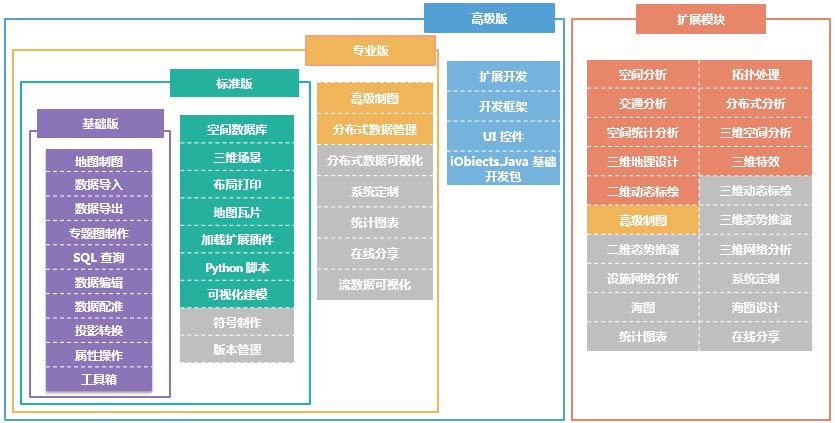

　　SuperMap iDesktop Java 是基于 SuperMap iObjects Java ，通过 Java 语言开发的插件式、跨平台GIS应用软件。为满足用户的不同需求，SuperMap iDesktop Java 提供了四种不同的版本，分别为基础版、标准版、专业版和高级版。版本级别从基础到开发版，能力依次增强，后一级别包含前一级别或前几级别中的功能。

　　同时，购买了标准版、专业版或高级版，三种任意一款桌面产品，均可在当前产品的基础上单独购买扩展模块，其中，系统定制、高级制图、统计图表以及在线分享4个模块属于高级版软件涵盖模块，购买过专业版无需再单独购买这四个扩展模块。注：基础版不支持加载扩展模块。

- **SuperMap iDesktop Java 基础版**：支持空间数据引擎SDX+管理文件数据；支持数据导入导出、类型转换、数据浏览和编辑等丰富的数据管理工具；提供了数据配准、投影转换等丰富的数据处理工具；提供了丰富的地图制图和专题图生产工具；提供工具箱对工具进行统一管理。
- **SuperMap iDesktop Java 标准版**：在基础版的基础上，支持空间数据引擎SDX+管理空间数据库；支持三维场景，立体效果展示，支持倾斜摄影和BIM模型；支持布局排版打印；支持根据需求定制符号；支持生产地图瓦片；支持定制符号；提供数据的版本管理，历史回溯能力；支持Python脚本扩展工具包；支持加载扩展插件；提供可视化建模将复杂的操作过程模型化并批量执行。
- **SuperMap iDesktop Java 专业版**：在标准版的基础上，内置了系统定制插件、高级制图插件、统计图表插件、在线分享插件。提供了对大数据进行分布式存储和管理、分布式大数据可视化的能力；支持实时数据的接入和动态可视化。
- **SuperMap iDesktop Java 高级版**：桌面产品中的旗舰 GIS 产品，涵盖了高级版的所有功能，支持基于桌面的插件式开发框架进行扩展开发，提供了丰富的UI控件和工具接口，内置了组件开发包。
- **扩展模块**：可单独购买的功能模块，购买了标准版、专业版或高级版，三种任意一款桌面产品，均可在当前产品的基础上单独购买扩展模块，其中，系统定制、高级制图、统计图表以及在线分享4个模块属于高级版软件涵盖模块，购买过专业版无需再单独购买这四个扩展模块。注：基础版不支持加载扩展模块。

　　桌面产品按照许可划分，各版本提供的许可模块如下图所示：

### 许可与功能模块对照表

　　基础版、标准版、专业版和高级版的功能模块如下表所述：

功能模块|功能说明|基础版|标准版|专业版|高级版|
----|----|----|----|----|----|
地图制图|提供地图显示、渲染、编辑以及强大的出图等功能。|√|√|√|√|
数据导入|支持导入矢量、栅格、模型等多种数据格式。支持的数据类型有：AutoCAD数据、ArcGis数据、影像栅格数据、三维模型数据、Lidar数据、Google数据、矢量文件、GeoJson、SimpleJson、GJB、电信数据等。|√|√|√|√|
数据导出|支持导出矢量、栅格、模型等多种数据格式。支持的数据类型有：GeoJson 文件，VCT文件、TIFF 文件、ArcGIS Grid 文件、电信栅格文件、TIN地形文件等。|√|√|√|√|
专题制图|提供了强大丰富的专题图制作功能，可以根据各种需求制作出生动、精美的专题图。包括标签专题图、单值专题图、统计专题图、分段专题图、点密度专题图、热力图与网格聚合图等。|√|√|√|√|
SQL 查询|支持通过SQL 表达式，进行数据查询。|√|√|√|√|
数据编辑|提供全面的数据编辑功能； 提供了丰富的矢量数据和栅格数据处理功能。支持对数据创建空间索引和字段索引。|√|√|√|√|
数据配准|提供数据配准功能，包括快速配准和批量配准。|√|√|√|√|
投影转换|提供数据坐标系设置及投影转换功能，其中投影转换包括：坐标点转换、数据集转换、批量投影转换、四参数转换以及转换模型参数计算。|√|√|√|√|
属性操作|提供对空间数据的属性表全面操作和处理，包括创建、编辑、浏览、输出功能以及统计分析等功能。|√|√|√|√|
工具箱|工具箱集成了丰富的数据处理和数据分析功能。|√|√|√|√|

### 标准版

　　**标准版**许可模块包括基础版的所有功能模块及以下模块：

功能模块|功能说明|基础版|标准版|专业版|高级版|备注|
----|----|----|----|----|----|----|
空间数据库|支持空间数据引擎SDX+管理空间数据库，支持13种以上的常用数据库读写，包括OraclePlus、OracleSpatial、SQLPlus、MySQL等，支持4种以上的国产数据库的读写，包括DM、Kingbase、HighgoDB、BeyonDB等。|X|√|√|√|  |
三维场景|提供对三维数据的浏览、编辑，实现二三维一体化的数据显示与操作。场景中支持多源数据进行显示和浏览。|X|√|√|√|  |
布局打印|提供布局排版、打印功能。|X|√|√|√|  |
符号制作|支持对符号资源以逻辑分组的方式进行管理；提供了制作新符号或者编辑已有的符号的功能。可通过界面交互的方式方便、快速、准确地完成符号制作编辑。|X|√|√|√|暂未支持，后续版本提供|
地图瓦片|提供单任务和多任务两种方式生成栅格瓦片或矢量瓦片，并支持更新/追加瓦片、检查瓦片、发布瓦片等全流程的地图瓦片技术。|X|√|√|√|  |
版本管理|提供数据的版本管理，历史回溯能力。|X|√|√|√|暂未支持，后续版本提供|
Python 脚本|内嵌Python窗口，支持通过Python脚本调用相关接口执行对应功能，实现了方法提示、自动补全的功能；集成丰富的数据处理功能，包括：数据集导入导出、叠加分析、创建泰森多边形、拓扑构面、密度聚类等；工具箱支持Python轻量级二次开发，且支持将开发功能添加到可视化建模中使用。|X|√|√|√|  |
可视化建模|可视化建模集合了丰富的数据处理和数据分析建模功能，用户可根据需要设计可连续执行的可视化模型，实现了无人值守、一键化的连续操作。|X|√|√|√|  |
加载扩展插件|支持单独加载扩展模块。|X|√|√|√|　　|

### 专业版

　　**专业版**许可模块包括标准版的所有功能模块及以下模块：

功能模块|功能说明|基础版|标准版|专业版|高级版|备注|
----|----|----|----|----|----|----|
系统定制|提供可视化的桌面系统功能和界面定制，快速定制桌面GIS系统。|X|X|√|√||
高级制图|提供多进程切图功能；DLG数据自动制图、分级配图、符号化制图等功能暂未提供|X|X|√|√|部分功能支持|
统计图表|提供丰富的图表可视化工具，基于属性数据快速统计，可以很方便的进行数据挖掘，可保存输出，可跟地图进行交互、联动。|X|X|√|√|暂未支持，后续版本提供|
在线分享|支持对接公有云Online和私有云iPortal，在线检索和分享地图、数据、符号库、色带、扩展插件和自定义资源；加载在线服务。支持对接iServer快速发布iServer服务。|X|X|√|√|暂未支持，后续版本提供|
分布式数据管理|提供对大数据进行分布式存储和管理。|X|X|√|√|  |
分布式数据可视化|提供分布式大数据可视化的能力。|X|X|√|√|暂未支持，后续版本提供|
流数据可视化|支持实时数据的接入和动态可视化。|X|X|√|√|暂未支持，后续版本提供|

### 高级版

　　**高级版**许可模块包括专业版的所有功能模块及以下模块：

功能模块|功能说明|基础版|标准版|专业版|高级版|
----|----|----|----|----|----|
扩展开发|支持基于桌面的插件式开发框架进行扩展开发。|X|X|X|√|
开发框架|提供基于桌面的插件式开发框架|X|X|X|√|
UI 控件|提供了丰富的UI控件和工具接口|X|X|X|√|
iObjects Java 基础开发包|提供 iObjects Java 基础开发包|X|X|X|√|

### 扩展模块

　　**扩展模块**:可单独购买的功能许可模块。

功能模块|功能说明|许可信息|备注|
-----|----|----|----|
系统定制|同专业版“系统定制” 高级版及以上或系统定制模块许可|  |   |
高级制图|同专业版“高级制图” 高级版及以上或高级制图模块许可|  |  |
统计图表|同专业版“统计图表” 高级版及以上或统计图表模块许可|  |  |
在线分享|同专业版“在线分享” 高级版及以上或在线分享模块许可|  |  |
拓扑处理|提供拓扑处理的功能。包括拓扑检查、拓扑构网、拓扑构面、拓扑错误自动修复、拓扑错误交互修复、拓扑关系维护和管理等功能。|拓扑处理许可|  |
空间分析|提供多种基于矢量数据、栅格数据的空间分析功能，包括缓冲区分析、叠加分析、插值分析、水文分析、表面分析、栅格统计、矢栅转换等功能，为 GIS 应用的分析决策提供强有力的支撑。|空间分析许可|  |
设施网络分析|提供设施网络分析。包括旅行商分析、最近设施查找、服务区分析、物流配送、选址分区，追踪最短路径、单要素\多要素追踪、邻接点、通达点\边分析等功能。|设施网络许可|暂未支持，后续版本提供|
交通分析|提供选址分区分析、旅行商分析、物流配送分析、最佳路径分析、最近设施查找分析等交通网络分析功能；提供基于线性参考的动态定位能力；提供路径规划和导航能力。| 交通分析模块许可 |提供部分功能|
海图|提供导入导出海图000数据、海图数据浏览、查看物标信息、编辑物标属性信息、设置海图的显示效果等功能。|海图许可|暂未支持，后续版本提供|
海图设计|基于国际海事组织（IHO）颁布的S-52显示标准显示电子海图；支持导入、导出或者制作符合S-57数据传输标准的海图数据；支持依据S-58电子航海图检核标准检查数据；确保数据空间和描述属性的有效性，提高生产质量。|海图设计许可|暂未支持，后续版本提供|
三维空间分析|提供基于三维场景的通视性、地形匹配等三维空间分析功能|三维空间分析许可|  |
三维特效|提供三维立体显示、三维粒子系统（雨雪火焰烟花喷泉等效果）、三维材质（水面效果）、太阳阴影等三维特效功能。|三维粒子特效许可|  |
三维网络分析|提供三维建模、三维设施网络分析和三维交通网络分析以及爆管分析的功能。|三维网络分析许可|暂未支持，后续版本提供|
二维动态标绘|提供二维动态标绘功能及所带的二维动态标绘符号库。|二维动态标绘许可|  |
三维动态标绘|提供三维动态标绘功能及所带的三维动态标绘符号库。|三维动态标绘许可|暂未支持，后续版本提供|
二维态势推演|提供基于二维动态标绘的态势推演功能。| 二维态势推演许可|暂未支持，后续版本提|
三维态势推演|提供基于三维动态标绘的态势推演功能。|三维态势推演许可|暂未支持，后续版本中提供|
三维地理设计|提供规则建模功能，包括三维几何体、房屋、地质体的构建；提供模型数据的提取、分析和计算功能，包括简化、凸包、阴影体、布尔运算、剖面分析、提取边界等；提供倾斜摄影、地形数据的裁剪、镶嵌与历史数据管理功能。|三维地理设计许可|  |
空间统计分析|支持利用统计分析方法，通过空间数据，认识与地理位置相关的数据间的空间依赖、空间关联或空间自相关，通过空间位置建立数据间的统计关系。|空间统计分析模块许可|  |
分布式分析|支持存储和管理多种分布式数据，包括HDFS、Hbase、iServer DataStore引擎，支持在线的多种基于分布式数据的计算和分析，包括密度分析、叠加计算、对象查询、空间汇总等。|分布式分析模块许可| 　 |
