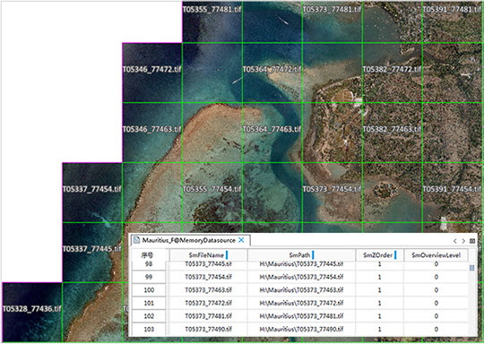
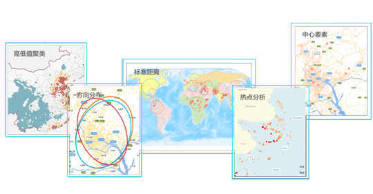
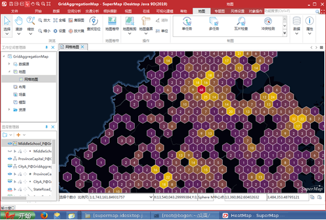
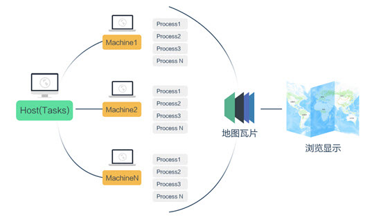
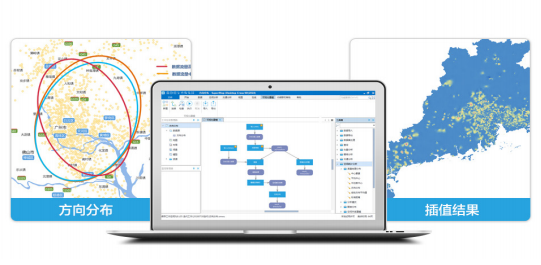
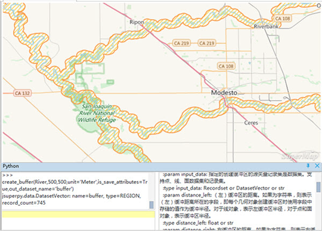

SuperMap iDesktop Java是业界首款跨平台全功能桌面GIS软件，突破了专业桌面GIS软件只能运行于Windows环境的困境，可在Linux环境中完美运行。SuperMap iDesktop Java 提供了适用于不同平台的版本，分为 Windows 和 Linux 两个版本。  
  
SuperMap iDesktop Java 是基于 SuperMap iObjects Java，通过 Java 语言开发的插件式、跨平台GIS应用软件，提供了数据管理、数据处理、空间分析、地图制图出图、可视化建模、三维等功能，同时提供了灵活的开发框架和辅助控件，便于用户二次开发。

## 谁需要SuperMap iDesktop Java 9D？

- 跨平台的空间数据生产和加工人员。 
- 跨平台的空间数据分析人员。 
- 跨平台的应用系统定制开发人员。 

## 为什么选择SuperMap iDesktop Java 9D？

- 国内首个支持跨平台的桌面GIS产品，用户在系统的选型上有更大的灵活性。 
- 支持数据编辑、地图渲染、专题图制作，可满足用户地图制图需求。 
- 支持丰富的数据处理、空间分析工具，可通过建模，一键化执行多个工具。
- 支持Java语言扩展开发，插件式方式便于定制扩展。 

## 系统支持

SuperMap iDesktop Java 支持在 Windows 和 Linux 系统中运行，支持的系统如下：

- Windows：支持Windows 7、Windows 8、Windows 10、Windows Server 2012等；
- 支持已部署 jdk/jre 1.7及以上版本的 linux操作系统，如中标麒麟、Ubuntu、Ubuntukylin、Redhat、SUSE等。

## 产品特点

### 跨平台、Ribbon界面、可定制

-   采用 Java 语言开发，具有跨平台的特性，支持在 Windows 和 Linux 系统中运行。
-   支持 x86、Power、ARM、MIPS、 Alpha 等 CPU 架构，包括自主CPU：飞腾、龙芯、申威等。
-   支持操作系统系列：Linux、Windows 等，包括中自主操作系统：中标麒麟、银河麒麟、深度等。
-   Ribbon 界面风格，取代传统的菜单工具条模式，功能组织更清晰、直观。
-   支持界面换肤，提供 Red、Blue、Black 三种不同主题风格的切换。
-   Ribbon界面通过配置文件进行配置和管理，无须编程。

## 提供功能

### 数据管理

SuperMap iDesktop Java 具备常用的数据管理功能，多方位兼容用户数据，提供了工作空间管理、数据源管理、数据集管理功能；支持文件型、数据库型、Web型数据引擎。

-  提供了工作空间、数据源及数据集管理功能；
-  支持 UDB、UDBX 文件型引擎；
-  支持丰富的数据库引擎，如PostGIS、PostgreSQL、Oracle、SQLPlus、DB2、MySQL 等数据库；
-  支持瀚高、星瑞格、南大通用、达梦、人大金仓等 国产数据库；
-  支持打开Web地图数据，即OGC服务、iServerREST服务、超图云、GoogleMaps、OpenStreetMap 等Web地图。
-  支持50多种GIS/非GIS数据格式的导入，并支持30多种数据格式导出，如\*.dwg、\*.shp、\*.csv、\*.tif、\*.img、\*.dem等。
-  以镶嵌数据集的方式管理与共享海量影像数据。

　　

### 数据编辑与处理

数据处理是GIS的基础功能，SuperMap iDesktop Java 目前提供的数据处理功能有：投影设置、配准、数据编辑、查询、拓扑处理、矢量和栅格数据处理等。

-  提供30种以上对象编辑功能，可进行组合、求交、合并、节点编辑、分解等操作，并支持自动绘制和智能捕捉。 
-  支持线、面自动矢量化，提高矢量化工作效率。
-  支持设置数据集坐标系，并支持10种坐标系转换模型。
-  支持对单个或多个数据集进行配准，根据参考数据对配准数据进行空间位置纠正和变换。
-  提供30种以上对象编辑功能，可进行组合、求交、合并、节点编辑、分解等操作，并支持自动绘制和智能捕捉。
-  支持创建数据索引，以提高数据的浏览效率，矢量数据可创建空间索引，栅格数据可创建影像金字塔。
-  提供 200 多种矢量、栅格数据处理功能，例如融合、追加、聚类、重采样、影像合成等。
-  提供拓扑检查、拓扑构网、拓扑构面、线拓扑处理等拓扑功能。
-  支持SQL查询和空间查询，可查询出符合过滤条件的对象。

### 数据分析

-  支持缓冲区分析、叠加分析、邻近分析等矢量空间分析，提取需要的空间信息，应用与农业、城市规划、生态保护等诸多领域。
-  提供等值线/面提取、坡度、坡向、填挖方、三维晕渲等表面分析功能，提取更多栅格表面特征信息。
-  支持多种类型的插值分析，可将采样点的属性值内插到指定范围中。 
-  提供表面分析功能，可提取更多原始数据集中所暗含的空间特征、空间格局等信息。 
-  提供距离栅格分析功能，考虑耗费的影像更准确的评估源于目标的距离。 
-  支持水文分析，基于高程模型（DEM）建立水系模型，用于研究流域水文特征和模拟地表水文过程，并对未来的地表水文情况作出估计。
-  提供动态分段功能，可依据事件属性表中的距离值对线性要素进行动态逻辑分段，动态的计算出属性数据的空间位置。
-  提供空间统计分析，可分析和预测与空间或时空现象相关的统计值，包括度量地理分析、模型分析、聚类分布、空间关系建模等，用于分析数据的要素间的聚合、离散关系、结构和趋势等。

　　

### 地图制图

提供地图显示、渲染、编辑等功能；提供了二三维点、线、面图层风格设置功能；支持制作及修改单值、分段、标签、统计专题图。

-  提供了综合的地图显示、渲染、编辑以及强大的出图等功能。
-  内置 7 种色板，200 多个色带，1000 多个的点、线、面符号，提升地图的美观性。
-  支持制作、修改专题图，提供了单值、分段、标签、统计、点密度、等级符号、自定义七种矢量专题图类型。
-  提供了热力图和网格图两种聚合图类型，通过颜色的变化趋势，直观的展现点数据的密度分布特征。
-  支持加载、输出地图模板、专题图模板，可快捷的根据模板创建地图。
-  提供地图分幅、地图网格、标准图幅图框等制图工具。
-  支持对图层设置可见比例尺，提高了地图的美观性以及显示效率。
-  支持距离、面积、角度三种量算类型。
-  支持地图裁剪，可对地图中的单个或多个图层进行裁剪，裁剪指定区域的数据。

　　

### 地图瓦片

- 支持多进程切图功能，可在单个或者多个机器上启多条进程，执行地图切瓦片任务，并支持调整进程书，合理利用计算机资源，有效地缩短了生成地图瓦片的时间。 
- 支持将矢量地图生成 MapBox MVT 规范的矢量瓦片，以OpenLayers渲染方式显示，矢量瓦片体积小，可高度压缩，占用的存储空间小，便于发送到 Web 平台和移动端。
- 支持瓦片更新功能，可以根据指定的瓦片范围，更新指定区域和比例尺的瓦片。 
- 提供瓦片检查和补切功能，检查是否存在错误瓦片，根据检查结果，对存在错误的瓦片进行补切。 
- 支持将同一区域不同时期的地图切成多个版本的瓦片，保存到 MongoDB 中。并支持将瓦片加载到地图中进行动态播放，方便用户对比、查看不同时期的地图变化。 

　　

### 布局打印

-  向导式创建布局，并提供17 种布局模板，可根据布局模版和指定的地图，便捷的创建布局。
-  支持输出为PDF，便于地图的输出与打印。
-  支持在布局中添加地图、图例、指北针、文本等要素，并支持要素排版。

### 可视化建模

可视化建模支持对数据导入、处理、分析等功能进行建模，用户可根据需要设计可连续执行数据处理的工作流模型，实现了一键化连续操作。

-  工具箱支持上100多种功能模型，包括核密度分析、热度图等大数据分析功能，度量地理分析、模型分析等空间统计分析功能，以及插值分析、表面分析等多种空间分析功能。
-  工具箱支持功能搜索，快速定位
-  支持运行单个节点，也支持执行整个工作流，并可对执行过程进行控制和管理。 
-  支持将构建好的工作模型保存到工作空间中，便于后续使用或修改工作模型中的操作步骤及参数等。
-  支持将已构建工作模型输出为模板，可通过加载模板便捷的创建模型。
-  支持检查创建的工作模型程是否存在错误，如是否存在游离节点、死循环、功能无数据输入等情况。
-  提供了动态分段、水文分析模版，便于用户直接使用模型。

　　

### Python

- 内嵌 Python IDE 和运行环境，支持通过Python脚本进行数据处理与分析。
- 集成数据处理、拓扑、插值、邻近分析等 Python 组件功能。
- 内嵌函数帮助，接口方法智能提示、自动补全。
- 支持Python二次开发，提供预定义的 Python 模板。
- Python定制的功能，可与可视化建模结合使用。

　　

### 大数据

-  支持对大数据进行管理，通过访问已部署的HDFS地址，对数据进行上传、下载、文件夹管理等操作。
-  支持 SuperMap iServer DataStore 大数据服务引擎，便于用户直接使用其中的数据进行数据处理与分析操作。
-  提供密度分析、热点分析、聚合分析、区域汇总等分布式空间分析功能。
-  提供矢量裁剪、单对象查询等分布式数据处理功能。

### 发布服务

-  支持发布 iServer 服务 ，可将工作空间中的数据资源发布到本地或远程服务器上，以 Web 形式实现资源共享 。
-  支持将矢量瓦片(MVT)和栅格瓦片作为数据来源直接发布为地图服务，以Web 形式进行浏览查看以达到资源共享。

###  三维浏览与构建

-  支持影像、地形、地图、矢量、手工建模数据、地 下管线、倾斜摄影模型、BIM、激光点云、三维场数据等海量、 多源、异构数据的高性能加载与显示。
-  支持导入的模型格式：S3M、FBX、DAE、X、OBJ、3DS、OSGB/OSG、STL、OFF、SKP 等。
-  支持导出的模型格式：S3M、OSGB、DAE、glTF、OFF、STL、KML/KMZ 等。
-  支持开启地下模式，使地下场景可见，并支持设置地下颜色、可见深度、透明度等。
-  支持对二维矢量数据进行拉伸设置，包括高度模式、底部高程、拉伸高度、贴图设置。
-  提供场景量算功能，包括距离量算、面积量算、高度量算，并支持设置量算单位，清除量算结果。
-  支持飞行航线的设置，从不同方位、角度来自动浏览场景，提供飞行路线的创建、站点管理、飞行参数设置等功能。
-  支持三维空间分析及分析结果输出：通视分析、可视域分析、天际线分析、日照分析、剖面分析、开敞度分析等。
-  支持三维点、线、面、体构建三维缓冲区。
-  支持基于规则的快速建模：拉伸、旋转拉伸、放样、构建直骨架、纹理映射等。
-  提供针对倾斜摄影模型的空间运算：多边形裁剪、多边形挖洞、多边形镶嵌、构建拉伸闭合体、剔除悬浮物等。
-  提供针对 TIN 地形的空间运算：多边形裁剪、多边形挖洞、多边形镶嵌、与三维体对象的布尔运算、构建拉伸闭合体等。
-  支持倾斜摄影模型数据的快速加载、渲染，并支持倾斜摄影数据的管理和处理功能。
-  支持倾斜摄影数据保存到MongoDB数据库，并支持加密，确保数据分享时的安全性。
-  倾斜摄影建模数据结合对应矢量面数据可实现单体模型选中亮高、属性信息查询、空间查询、缓冲区分析等操作。
