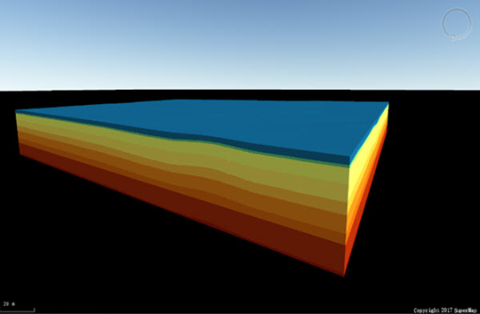
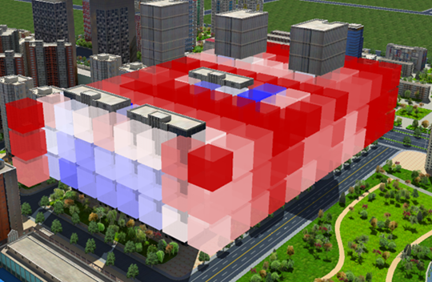
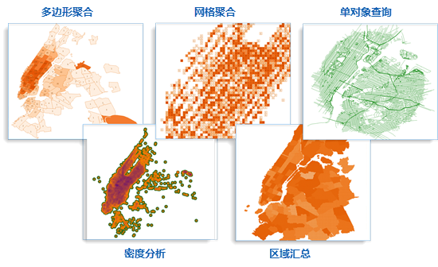

　　SuperMap iDesktop Java 9D(2019) 桌面产品在上一版本基础上，新增动态分段、布局、三维、Python等模块的功能，并优化和丰富数据管理、数据编辑、数据处理、地图制图、数据分析、可视化建模、二次开发等模块的功能。其中，数据管理模块增加镶嵌数据集、模型数据转换等功能，坐标系增加EPSG Code信息；数据编辑模块新增多种对象编辑功能，并支持自动绘制设置；地图制图模块增加四色专题图、标准图幅图框、地图卷帘等功能，同时优化多进程切图的相关操作；数据分析模块丰富表面分析功能，新增动态分段；新增布局排版与打印模块，提供完整的布局制作与出图的功能。同时，SuperMap iDesktop Java 9D(2019) 支持Python，可编写Python脚本执行连续的GIS数据处理操作。

**SuperMap iDesktop Java 9D(2019) 包含以下新增功能和优化之处：**

### 交互与操作

 - 优化工具箱的功能搜索，支持按Enter键定位到第一个或鼠标选中的功能，并支持精确搜索和模糊匹配。
 - 新增全局功能搜索，可对Ribbon和工具箱的功能进行搜索，帮助用户快速定位到想要的功能。
 - 优化屏幕上文本 DPI 显示百分比大于100%，桌面界面的显示效果，提升用户体验。
 - 工作空间管理器窗口支持上一级、前进，便于用户快速定位到指定的工作空间目录，支持大小图标、列表、详细信息三种显示方式。
 - 工作空间管理器支持对数据集进行排序，提供了名称、类型、创建顺序、对象个数四种排序类型。
 - 优化数值型文本控件，当控件中的值为空或是超出值域范围时，会出现值域范围的提示。
 - 优化输出窗口，默认最小化，并且在底边栏输出内容，鼠标移动到底边栏点击，则弹出输出窗口。
 - 输出窗口支持显示超链接，通过不同的风格样式显示提示、警告、错误、常规信息等输出信息。
 - 提供非管理员启动程序，兼容管理员和普通用户，普通用户不需要输入管理员账号密码即可使用桌面。

### 数据管理与转换

 - 新支持以下几种数据格式的导入：
   - ArcGIS的栅格数据：*.asc数据；
   - 三维模型文件：*.osg、*.obj、*.ifc、*.fbx、*.dae、*.stl、*.off、*.sgm；
   - 栅格文件：.bin、.vrt；
   - Grib2气象数据。
 - 优化坐标系管理功能，在坐标系信息中增加了EPSG Code，可通过EPSG Code搜索和新建坐标系。
 - 新增镶嵌数据集新建和管理功能，便于管理多景影像数据文件（IMG、TIFF），以图层的方式显示多幅影像的拼接效果。
   - 支持添加单个影像文件，也支持通过文件夹方式，批量添加指定格式的影像文件；
   - 支持多进程创建影像金字塔和构建概视图，提高镶嵌数据集的浏览效率，并支持删除影像金字塔；
   - 支持设置镶嵌数据集的边界线和轮廓线在地图中的显示风格，支持查看轮廓、边界范围及数据集属性；
   - 支持重建轮廓、重建边界和重建裁剪范围；
   - 支持浏览轮廓数据的属性表信息，便于查看每个源文件的来源和数据范围等信息；
   - 支持导出指定范围的镶嵌数据集源文件，数据格式与源文件相同，也支持导出镶嵌数据集的源文件清单；
   - 支持追加、重新指定影像文件到镶嵌数据集中，同时支持清空数据和统计信息等操作。
 - 支持新的数据引擎，即SinoDB、PostGIS数据库引擎。
 - 支持UDBX格式的数据源，避免了意外导致数据损坏的问题，大数据查询效率高。
 - 新建和打开数据库型数据源时，增加了各类型数据库可用性的判断，不可用的数据库类型会灰显，用户可配置好对应的数据库环境再使用。
 - 新增选中对象另存为数据集功能，便于用户从大范围数据中提取小范围的研究区域。
 - 新增紧缩数据源功能，使其减少数据量，占用较少的磁盘空间。
 - 支持以快捷键 Ctrl+C 和 Ctrl+V 的方式，对数据集进行复制、粘贴，使数据源之间数据集的迁移更便捷简单。
 - 优化SQL查询，可保留上一次的查询信息，可在已知历史查询条件的情况下，继续修改查询条件，进行多次查询。
 - 工作空间属性支持显示统计信息，可统计当前工作空间中数据源、地图、布局、场景的个数。

### 数据编辑

- 新增移动对象功能，提供了指定坐标、指定方向、指定偏移、定位复制四种移动方式。
- 新增局部更新功能，可用于更新线对象或面对象的范围。
- 新增精确打断功能，可根据段数、段长或间距打断线对象。
- 新增倒圆角功能，对两条线段的邻近端点延伸或修剪，以一个与两条线均相切的圆弧连接形成圆角。
- 新增倒直角功能，对两条线段的邻近端点延伸或修剪，最终连接形成倒角。
- 支持绘制设置，可设置最大可见节点数目和批量编辑最大记录数。
- 新增自动连接线功能，可将多次绘制的线对象在节点捕捉的位置进行连接，得到一个新的线对象，可以提高用户矢量化的速度。
- 新增自动打断线功能，在绘制线对象时，会在相交位置将原对象和新绘制的线对象自动打断，并同时成多个线对象。
- 新增自动切割面功能，在绘制面对象时，将当前绘制的面对象与其他面对象相交的部分自动切割除去，并得到新的对象。
- 新增编辑实时刷新功能，对当前地图中选中的对象进行编辑时，对背景地图（即当前地图非选中编辑的对象）进行实时刷新。
- 新增编辑节点自动协调功能，对相邻两个线或面对象的节点进行调整时，会同时对两个对象生效，并且始终保持拓扑关系。

### 数据处理

 - 增加拓扑检查功能，用于检查点、线、面数据集本身及各不同类型数据集其相互之间不符合拓扑规则的对象，并将检查结果保存到简单数据集或 CAD 数据集中。
 - 新增计算面积功能，便于统计面数据集中所有面对象的总面积，若为经纬度数据，则计算面对象的投影面积，同时支持平方米、平方千米、亩、公顷等十余种单位的面积换算。
 - 新增属性更新功能，可对数据集中的对象属性进行更新。
 - 新增三维拓扑预处理功能，可检查并处理三维线数据的拓扑错误。
 - 优化容限默认值，将容限的默认值调整为1毫米。
 - 新增计算凹多边形功能，支持根据点数据集和最小内角角度，计算所有点对象的凹多边形。
 - 新增按面积分割对象功能，通过指定分割方向，将面对象按面积以指定块数分割或等比例分割。

### 属性操作

 - 多个桌面同时打开一个数据库型数据源，若其中一个桌面修改了数据，其他桌面可通过属性表刷新功能，查询最新属性信息。
 - 新增隐藏行和取消隐藏行的功能，可将属性表中的选中行隐藏，取消隐藏后即可正常显示。
 - 新增隐藏列和取消隐藏列的功能，可将属性表中的选中列隐藏，取消隐藏后即可正常显示。
 - 新增删除行功能，可删除矢量数据集的属性表或纯属性数据集中，选中的一行或多行属性记录。
 - 优化属性表定位，将对话框修改为非模态窗口，便于用户在属性表中直接选中行来设置定位的参数。
 - 优化更新列功能，可根据引擎类型自动过滤出可用运算函数。

### 地图制图

 - 优化捕捉设置功能，将其做为全局变量，并可以通过快捷键设置捕捉项。
 - 优化数据配准操作方式，支持添加地图作为配准和参考图层数据，并支持添加多个数据集到配准图层中进行批量配准，同时支持设置配准和参考图层的图层风格，使配准操作更高效易用。
 - 新增热力图的参数设置，支持设置热力图的聚合函数、颜色模式、源点可见比例尺，优化了热力图的显示效果。
 - 新增四色专题图和单值标签专题图，丰富了专题图的类型，满足用户更多的制图需求。
 - 支持新建空白单值专题图，可基于空字段创建一幅专题图，用户可自行指定字段表达式。
 - 新增专题图模版功能，支持模版导入、导出，可将专题图模板保存到库里，并支持模版管理。
 - 新增专题图编辑功能，支持将标签、等级符号、统计符号移动到合适的位置。
 - 优化地图色带，新增并调整了色带风格，是专题图颜色更绚丽。
 - 支持将地图瓦片发布为iServer服务，可将矢量瓦片和栅格瓦片发布为iServer服务，支持在桌面及 iServer 端进行加载、浏览，便于资源共享。
 - 支持设置地图中选中对象风格，并增加统一控制选中对象风格的功能，即全局设置。
 - 支持单任务和多任务方式将矢量地图生成 MapBox MVT 规范的矢量瓦片，支持OpenLayers渲染方式显示，矢量瓦片体积小，可高度压缩，占用的存储空间小，便于发送到 Web 平台和移动端。

 - 多进程切图为提升用户体验，优化了以下几点： 
     - 当瓦片存储类型为MongoDB时，支持查看MongoDB的写入速度；
     - 切瓦片子任务连续失败12次，会自动停止切图；
     - 优化了切图进度条的计算方式，进度信息更准确。
 - 优化多版本瓦片播放，支持设置参与播放的版本、调整播放顺序，动态播放时支持设置渐变效果。
 - 新增地图网格功能，可将地图划分为大小不同的网格，以表达网格内的特征分布和变化，与自然或行政区划界线有所不同。
 - 新增地图鹰眼，鹰眼图即地图显示范围的缩略图，可显示当前地图窗口在整幅地图中的位置。
 - 新增地图放大镜功能，将地图窗口中的内容加载到放大镜窗口中，并以指定的放大倍数放大显示地图内容。
 - 新增接图表功能，可按照比例尺和地理范围参数，将地图划分为尺寸适宜的若干幅地图，生成标准的图幅数据集，以便于地图索引、制图、分块操作等。
 - 新增标签预处理功能，可根据相关的分割原则，在指定的文本字段信息中添加分隔符，用预处理的结果字段来制作标签专题图，使标签显示更合理、更美观。
 - 新增标准图幅图框，可以方便快捷地创建基于国家基本比例尺的各种图幅，提升地图制作的专业性。
 - 新增地图查找与定位功能，支持查找某个特定属性值分布在当前地图的哪些图层中，并实现快速定位。
 - 优化鼠标拾取地图坐标，支持捕捉功能，便于准确的拾取到节点位置。
 - 选项卡中增加了风格设置功能，可在Ribbon上设置地图或布局的风格。
 - 优化多对象拆分裁剪功能，支持将多个对象分别裁剪的结果保存至同一个数据集中。
 - 多波段影像数据支持在图层管理器中展开查看RGB波段，并支持设置R、G、B的波段。
 - 新增重新指定数据集功能，可重新指定单个图层的数据集，也批量指定地图中所有图层关联的数据集，便于快捷的更新地图数据。
 - 支持地图和布局输出为PDF文件，可指定输出范围和分辨率，便于地图/布局的打印。
 - 支持图层属性模板的加载与输出，可便捷的将图层属性模板加载到其他图层中使用。
 - 影像图层属性支持设置无值、无值透明、背景值、背景透明、显示方式、颜色模式等参数的设置，便于用户更好的设置影像图层的显示效果。
 - 支持图层的复制，可将复制的图层粘贴到当前地图或其他地图中，粘贴的图层会保留原图层的风格和属性，可重复使用配制好的图层好的风格，提高了制图效率。
 - 支持插入图层，可将当前工作空间中的数据插入到选中图层的上方。

### 布局

 - 支持布局基本操作，包括新建、打开、保存、删除等功能。
 - 支持根据布局模板创建布局：
   - 支持预览和检索布局模板，并支持指定地图对象快速制作布局。
   - 优化对布局模板的管理，包括编辑已有布局模板，导入/导出模板，以及对模板进行分组管理、修改布局模板信息等操作。
   - 新增多种不同类型的布局模板，可基于模板新建布局，以满足用户在不同场景下的需求。
 - 支持布局对象操作，包括对象绘制、对象排序、组合、对齐、大小等功能。
   - 支持在布局中绘制点、线、面、文本、地图、比例尺、图例、指北针，并支持添加图片；
   - 支持通过置顶、置底、上移一层、下移一层的方式来调整对象顺序；
   - 支持将布局中选中的多个对象进行组合和拆分；
   - 支持调整布局对象的对齐方式；
   - 支持通过等宽、等高、等大小三种方式调整选中对象的大小。
 - 支持查看、修改布局属性，及布局对象属性。
 - 支持布局浏览操作，提供了选择、漫游、缩放、放大、缩小、整页显示等功能。
 - 支持布局中的地图操作功能，锁定地图后，可对地图进行放大、缩小、漫游、缩放、全幅显示、刷新的操作。
 - 支持对布局的页面的纸张方向大小、页边距、页数进行设置。
 - 提供布局风格设置功能，支持设置布局中点、线、面、文本风格。
 - 支持将布局输出为图片。 
 - 支持输出布局模板，并支持保存到模板库。

### 空间分析

 - 支持提取指定等值面，可以按照用户的需要提取指定范围内的特定值等值面。
 - 支持提取指定等值线，可以按照用户的需要提取指定范围内的特定值等值线
 - 新增点选提取等值线功能，可提取与鼠标点击位置处高程值相等的所有等值线。
 - 新增可视域分析功能，分析观察点所能通视覆盖的区域，在航海、航空以及军事方面有较为广泛的应用。
 - 新增两点和多点可视性分析，可分析两点或多点间是否可以相互通视。
 - 支持表面距离量算，计算在栅格数据集拟合的三维曲面上沿指定的线段或折线段的曲面距离。
 - 支持表面面积量算，计算所选多边形区域内的栅格数据集拟合的曲面的总的表面面积
 - 支持表面体积量算，计算所选多边形区域内的栅格数据集拟合的三维曲面与一个基准平面之间的空间上的体积。
 - 新增三维缓冲区分析，可在三维点周围根据指定半径建立的球体，或在三维线数据周围根据指定半径建立圆柱体。
 - 新增剖面分析，分析剖面线所经过地区的高程、起伏情况，有利于对修筑道路的难度、可行性进行评定。
 - 新增DEM切割，将栅格数据的一部分作为研究范围，并保持原有栅格数据的空间范围。
 - 新增查找极值功能，在栅格数据集上查找某些区域范围的极值点，包括最高点和最低点。
 - 支持栅格查询设置，可设置查询结果的是否显示栅格信息和坡度坡向值，同时可设置高程缩放系数等参数。

### 交通分析

 - 新增动态分段功能，可依据事件属性表中的距离值对线性要素进行动态逻辑分段，动态的计算出属性数据的空间位置。主要提供了以下功能：
   - 支持生成路由，通过点数据或者线数据集关联刻度字段生成路由数据集。
   - 支持校准路由，有利于保证测量值的正确性，从而保证事件被精确定位。
   - 支持生成事件表，生成包含点或者线事件的属性表。
   - 支持叠加事件表，可从已有的事件表中获取更多有利于解决实际问题的信息。
   - 支持融合事件表，可将某一个事件具有相同路由标识 ID 和融合字段值的事件，按照一定方式进行合并，从而达到去除冗余信息或依据不同属性信息对事件表进行拆分的目的。
   - 支持生成空间数据，根据路由数据集，将事件表中的事件定位的空间中，生成相应的点或者线数据，更好地帮助分析者全面的了解此类事件。
   - 支持关系管理，主要包括对数据源或者数据集之间动态分段关系的查询和删除以及路由数据集、事件表与空间数据之间联动关系的编辑。
 - 支持提取M值，根据间距提取路由数据的刻度值，提取结果为点数据，可用于在地图中对路由数据进行M值的刻度标识，便于用户了解每段路由的路由值。

 - 支持查询M值，可查询指定路由图层中，鼠标所在位置的路由M值，便于用户了解路由数据具体路段处的 M 值。
 - 新增拓扑构网功能，可据指定的点数据集、线数据集或网络数据集联合生成二维网络数据集。

### 三维

 - 场景交互
   - 支持开启地下模式，使地下场景可见，并支持设置地下颜色、可见深度、透明度等。
   - 支持对二维矢量数据进行拉伸设置，包括高度模式、底部高程、拉伸高度、贴图设置。
   - 新增场景量算功能，包括距离量算、面积量算、高度量算，并支持设置量算单位，清除量算结果。
   - 工作空间中保存的场景，支持按名称排序。

 - 对象操作
   - 新增线性拉伸建模功能，支持对二维或三维面数据进行拉伸建模操作，实现面对象快速建立三维模型。
   - 新增拉伸闭合体建模功能，支持对三维面进行拉伸构建拉伸闭合体。
   - 新增构建坡屋顶建模功能，支持对二三维面数据集构建坡屋顶，支持对生成的模型设置材质。
   - 新增布尔运算功能，包括单模型布尔运算和多模型布尔运算，支持输出布尔运算结果。
   - 新增阴影体功能，支持在太阳光源或点光源下对模型数据集构建阴影体。
   - 新增地质体构建功能，依据多个地质监测点数据集（仅支持地理坐标系）实现对地质体模型的构建。
   - 新增地质体剖面分析功能，根据剖切线或面数据集，提取地质的剖面模型。
   - 新增地质体钻孔分析功能，根据地质钻孔点数据集，获取地质模型中的钻孔模型。
   - 新增三角网简化功能，实现对图层中所有或选中BIM模型对象的简化，降低内存的占用，满足大体量数据的性能需要。
   - 新增子对象简化功能，简化或删除选中对象的子对象。
   - 新增模型平移功能，平移选中或全部模型对象。
   - 新增模型旋转功能，旋转选中或全部模型对象，仅支持地理坐标系。
   - 新增批量平移功能，平移当前场景中的所有模型。
   - 新增模型Z坐标归零功能，支持模型相对坐标Z归零和模型定位点坐标Z归零，坐标归零结果均不改变模型的绝对位置。
   - 新增空间查询功能，实现在查询图层中查询与指定查询对象具备查询条件的所有模型对象。
   - 新增TIN地形裁剪功能，实现对TIN地形缓存数据进行区域裁剪。
   - 新增TIN地形挖洞功能，实现对指定TIN地形进行区域挖洞。
   - 新增TIN地形镶嵌功能，实现对指定TIN地形进去区域镶嵌。
   - 新增TIN地形布尔运算功能，将TIN地形与模型数据进行求差或合并运算，获得新的TIN地形数据。
   - 新增TIN地形拉伸闭合体功能，对TIN地形向下拉伸至指定高程处，形成一个闭合体，可用于3D打印的实体模型构建。
   - 新增TIN地形修改功能，实现对当前TIN地形的实时修改。
   - 新增倾斜摄影数据裁剪功能，实现对倾斜摄影模型的区域裁剪，支持预览裁剪结果。
   - 新增倾斜摄影数据挖洞功能，实现对倾斜摄影模型的区域挖洞，支持预览挖洞结果。
   - 新增倾斜摄影数据镶嵌功能，根据指定的多边形，实现与场景中指定倾斜摄影数据的镶嵌操作，镶嵌图层支持二维面和三维面图层，支持预览镶嵌结果。
   - 新增倾斜摄影数据拉伸闭合体功能，实现对倾斜摄影数据的指定范围构建拉伸闭合体，支持预览拉伸闭合体结果。
   - 新增倾斜摄影数据剔除悬浮物功能，实现对倾斜摄影数据中的异常悬浮物进行剔除。。
   - 新增倾斜摄影数据纹理替换功能，实现对倾斜摄影数据中指定对象的纹理进行替换，提供直接修改颜色和颜色镶嵌两种方法，支持预览纹理替换结果。
   - 新增构建凸包功能，获取模型凸包，或根据三维点构建凸包。
   - 新增获取截面功能，支持提取截面处模型数据集的二维和三维截面图。
   - 新增获取投影面功能，支持将三维模型对象投影到XY（二维）平面上，生成二维面对象。
   - 新增获取投影拉伸体功能，相当于对模型对象进行获取投影面和线性拉伸两重操作。
   - 新增提取边界功能，提取模型边界，包括投影轮廓边界和三角网边界。
   - 新增移除重复点功能，去除指定图层中选中或全部BIM模型对象的重复点或冗余点。
   - 新增重新计算法线功能，实现重新计算模型的法线。
   - 新增模型拆分功能，实现拆分全部或选中对象的子对象。
   - 新增模型合并功能，实现将多个模型合并为一个模型。
   - 新增模型编辑功能，支持更改模型的几何信息和子对象信息。

　　  

 - 数据加载显示
   - 支持二三维数据集和缓存的加载显示。
   - 支持倾斜摄影数据的加载显示。
   - 支持加载和新建KML数据。
   - 栅格数据集添加到场景时，支持选择是否添加为影像图层或地形图层。
   - 支持平面场景，适用于场景较小的平面坐标系数据，例如小区全景、楼盘展示或油田井架等大型设备。
   - 支持设置图层风格，可设置场景中的矢量数据点、线、面风格，以达到更好的显示效果。
   - 支持三维图层分组，方便图层的统一管理。

 - 对象绘制
   - 支持KML图层交互，可绘制三维对象、模型对象，添加城市小品。
   - 新增三维基本对象绘制，包括地标、三维点、三维线、三维面。
   - 新增规则模型对象绘制，包括长方体、圆柱体、圆锥体、球体、椭球体、棱锥体。
 - 图层属性
   - 新增倾斜摄影数据图层操作的历史记录的回看与回滚功能。
   - 支持查看场景对象属性，便于用户查看修改场景中的对象属性。
   - 新增三维图层基本属性设置。

- 飞行管理
   - 飞行管理是一种三维浏览结果，通过预先设置一系列飞行观测点的位置和观测角度来确定飞行航线，在飞行执行中，将根据飞行航线的设置从不同方位、角度来自动浏览场景。

- 新增场景属性面板
   - 支持设置场景基本属性，如显示帧率，状态条等。
   - 支持太阳轨迹设置。
   - 支持立体设置。
   - 支持地球多边形偏移。
   - 支持场景颜色设置。
- 新增支持生成三维瓦片
   - 单个数据集生成TIN瓦片，影像瓦片，矢量瓦片，s3m和osgb类型瓦片。
   - 整个场景生成三维瓦片，支持外挂符号和TIN地形。
- 三维空间分析 
   - 新增坡度坡向分析功能，于计算栅格数据集中各像元的坡度值，及像元坡度面的朝向。
   - 新增等值线分析功能，可根据栅格数据的像元值，提取指定区域的的等值线。
   - 新增淹没分析功能，可根据指定的最大、最小高程值及淹没速度，动态模拟某区域水位由最小高程涨到最大高程的淹没过程。
   - 新增通视分析功能，用于判断三维场景中任意两点之间的通视情况，支持高亮显示障碍物。
   - 新增三维可视域分析功能，基于一定的水平视角、垂直视角及指定范围半径，分析观察点在该区域内所有通视点的集合，支持结果保存和高亮显示可见体。
   - 新增日照分析功能，可根据指定区域所在的经纬度范围，计算该区域在某段时间内，可被太阳照射到的时间长度。
   - 新增剖面分析功能，可根据指定的剖面线，输出剖面线与地形数据的表面高程沿某条线（截面）的变化，或剖面线所截的模型建筑物、地下管线等的轮廓线。
   - 新增天际线分析功能，可根据观察点位置，输出观察点周围的建筑物与天空之间的边界线。

　　  

- 倾斜摄影
   - 支持生成配置文件功能，可将*.osgb 格式的三维切片缓存模型数据生成 *.scp 格式的配置文件，实现批量加载与浏览。
   - 支持生成历史记录功能，选择同一区域多个时期的倾斜摄影文件，分别设置倾斜摄影模型产生的时间，在确定的当前版本上生成历史记录，方便统一管理同一区域的倾斜摄影文件。
   - 新增合并根节点功能，可将相邻一定空间范围的根节点合并为一个根节点，提升加载效率。
   - 支持生成代理节点，可为倾斜摄影模型生成不包含模型数据的代理节点及新的配置文件。
   - 支持修改模型中心点，通过修改数据本身的坐标信息，用于解决同一测区的倾斜摄影数据多个中心点的问题，实现一个*.scp配置文件加载所有数据的要求。
   - 支持模型生成大文件，可将存储在多个文件夹下的诸多碎文件生成为一个*.cf格式的倾斜摄影模型大文件，进一步提升倾斜摄影模型的加载浏览效率。
   - 新增保存到MongoDB功能，可根据源 *.scp 文件，将其关联的 *.osgb 数据保存到 MongoDB 数据库中，并生成一个新的 *.scp 配置文件。
   - 支持另存模型数据集 ，可将倾斜摄影模型另存为模型数据集。
   - 支持提取高度值，根据指定面数据集，提取面数据集范围内倾斜摄影模型的底部高程和拉伸高度值。
   - 支持提取数据，根据指定的参数，在倾斜摄影模型上提取点/线/面数据，并生成对应的三维点/线/面数据。
   - 支持OSGB压缩并单体化 ，可对原始*.osgb格式的倾斜摄影模型数据进行纹理压缩、单体化，并生成*.s3m数据。
   - 新增 OBJ→OSGB 功能，可将由 PhotoScan 导出的*.obj 格式的倾斜摄影模型数据转换为 *.osgb 格式的数据。
   - 新增DEM/DOM转为OSGB功能，可将DEM与DOM数据一并转换为*.osgb格式的数据。
   - 支持OSGB转为DAE数据，可将*.osgb格式的数据直接转换为*.dae数据。
- 支持二维数据集和CAD数据集对象绘制
- 支持加载网络服务图层
   - 支持加载iServer服务图层。
   - 支持加载OGC服务。
   - 支持加载天地图服务。

### Python

 - 基于cpython进行封装，提供了完整的Python功能，通过Python脚本，可自动执行对应的操作。
 - Python集成的丰富的数据处理功能，包括：数据集导入导出、叠加分析、缓冲区分析、创建泰森多边形、拓扑构面、密度聚类、插值分析、栅格代数运算等。
 - 在Python窗口中输入脚本时，会显示详细的方法描述。
 - 在Python脚本窗口中，可通过上下键可查看Python的历史命令。
 - 编辑器可通过特殊颜色标识关键字。
 - 输入Python命令时，可根据光标位置自动补全。
 - 可自动获取当前工作空间中的数据进行操作。
 - 支持在工具箱中，通过鼠标右键查看Python脚本，同时还可查看该功能脚本的详细说明文档。
 - 支持在工具箱中添加Python工具，提供了选择Python文件、编辑Python脚本两种方式。
 - 支持修改和删除定制好的Python工具。

　　

### 可视化建模

 - 提供水文分析和动态分段的预定义模板，用户设置相关参数后，即可执行连续的分析。
 - 新增数据锁功能，为避免数据在执行相关处理和操作时被删除或重命名，会将数据集进行锁定，不让其同时参与多种数据处理。

### 在线分析

- 优化了在线分析、发布瓦片、发布工作空间的iServer服务登录方式，登录之后会记录登录信息，便于下次使用。
- 简化了在线分析数据输入方式，可直接使用在iServer中注册的数据进行分析，例如，在iServer中注册的PG、UDB等数据。
- 新增叠加分析功能，可将输入数据进行叠加分析，获取更多的空间信息。
- 新增轨迹重构功能，可根据不同时间下物体所处的不同位置，来描述该物体的运动轨迹。
- 支持通过下拉方式选择分析字段，并过滤显示符合条件的字段。

　　

### 二次开发

 - 放弃 osgi 框架，重新实现轻量级的桌面插件式框架。
 - 将Core工程瘦身，使其加载较快。
 - 新增Ribbon控件，如颜色控件、滑块控件、图层控件、字体、数据源、数据集、Group分组图标等。
 - 右键菜单支持多级菜单，并支持动态构造。

### 许可

 - 支持查看产品详细的许可信息，包括许可模块、许可类型、剩余时间。
 - 优化许可模块划分，拆分为基础版、标准版、专业版及高级版四种许可类型，级别能力依次增强，后一级别包含前一级别或前几级别中的功能。
 - 完善许可验证机制，多许可同时存在时，实现许可优先级以及权限的管理。
 - 支持云许可的正式许可。

