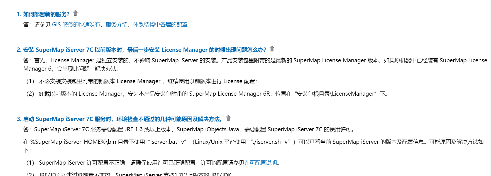
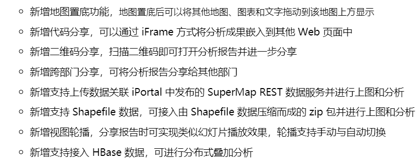
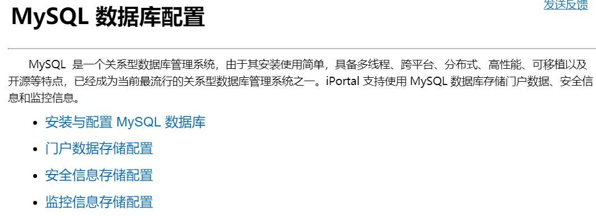
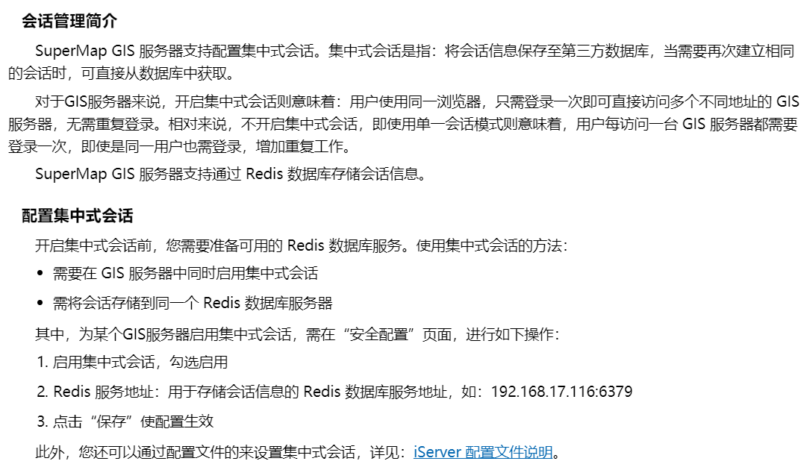
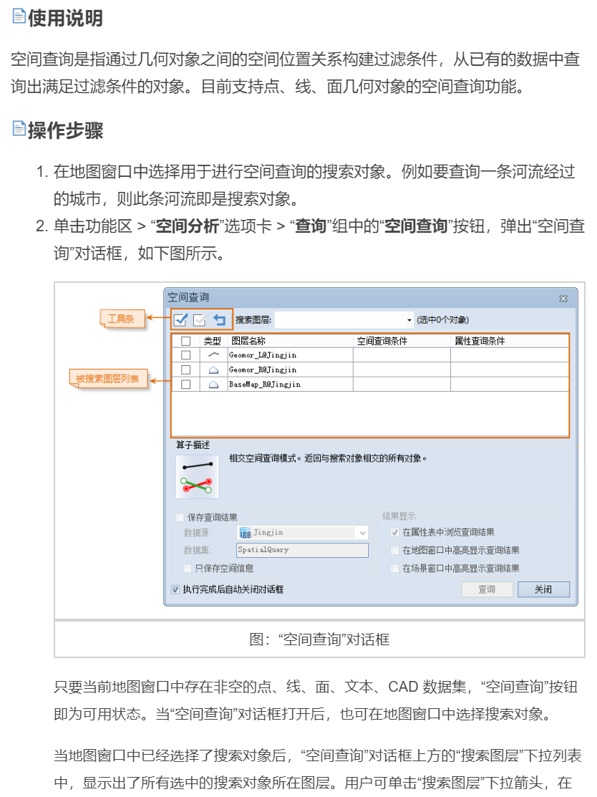
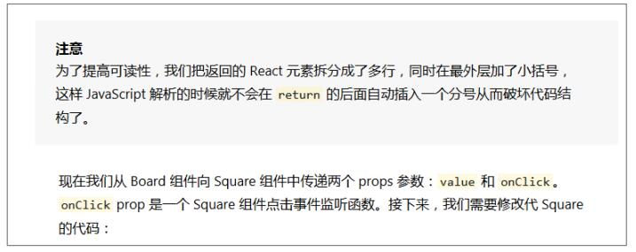
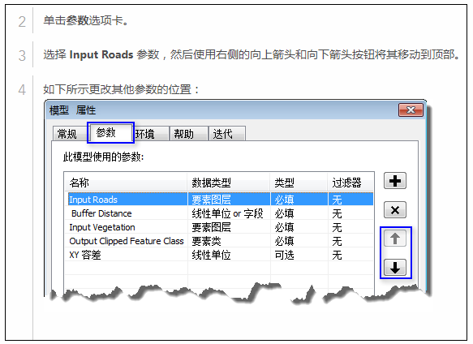

本规范主要制定了关于语言描述、主题内容的、特殊标识符号等方面的标准，供各位产品工程师攥写新版在线帮助文档时参考。本规范限用范围为所有产品文档。
规范中主要内容有：
- 统一所有产品文档中，共有内容的标题。
- 页面构成。包括新特性介绍页面、产品介绍页面、功能介绍页面、API等页面的构成。
- 语言描述规范，例如建议用词、句式，以及注意事项。
- 统一所有研发产品文档中可能涉及到的特殊符号。例如各种括号的使用，标点的注意事项等。
- 使用中英文专业词汇的规范。

## 统一标题
当前已有产品文档中部分内容的主题一致，但标题有差异，为帮助读者在阅读SuperMap的不同产品帮助文档时能够快速理解，本节对相同主题内容的标题进行统一，后续补充文档内容时可参考。

| 当前标题 ||||||||统一后的标题|
|---|---|---|---|---|---|---|---|---|---|
|iObjects| iDesktop .NET | iDesktop Java | iPortal | iServer | iEdge | iManager | Mobile |
| 用户群 | 用户群 | 用户群 | 面向的用户| 面向的用户 | 面向的用户 | 面向的用户||**面向的用户** |
|主要功能| 功能介绍 | 功能介绍 | 功能介绍 | 功能介绍 | 功能介绍 | 功能介绍 | 主要功能 | **功能介绍**|
|许可说明| 许可说明 | 许可说明 | 产品版本及模块介绍 | 产品版本及模块介绍 | | 版本划分 | 许可说明 | **产品版本及模块介绍** |
|SuperMap Universal 系列产品架构 | 产品体系 | 产品体系   | 云端一体化-产品体系介绍| 云端一体化-产品体系介绍 | 云端一体化-产品体系介绍 | 云GIS解决方案| 产品架构| 产品体系 |
| 主要特点 | 主要特点 | 主要特点| 主要特性| iServer产品特点 | iEdge产品特点 ||| **产品特点** |
| 产品入门 | 产品入门 | 产品入门 | 产品入门 | 使用入门 | 使用入门 | 使用入门 ||**入门** |
| 安装指南 | 安装指南 || iPortal安装指南 | iServer安装指南 | iEdge安装指南 | 部署指南 || **安装指南**  |
| 开发指南 | 二次开发 | 二次开发 | iPortal开发与扩展指南 | iServer开发与扩展指南 | 开发指南 || 开发指南 | **开发者指南** |
| 常见问题解答 | 常见问题解答 | 常见问题解答 | 常见问题解答  | 常见问题解答 | FAQ | 常见问题解答 | 常见问题解答（FAQ） | 常见问题解答 | **常见问题解答** |
| API | 程序员参考 | 程序员参考   | 程序员参考 | API参考 | API参考 | API参考| API参考 | **API参考** |

## 页面构成
在写帮助文档时，考虑需要通过帮助文档向用户传递哪些信息，以及如何准确清晰地传达这些信息是十分重要的步骤。在本节中，就将针对现有产品帮助文档中共同涉及到的页面内容做出规范：在写不同类型的帮助页面时，需要向用户介绍哪些信息，以及以什么结构顺序展示。

### 新特性页面
新特性页面主要内容为相较于上个版本，新版本的新增功能、变更和已修复或解决的问题，以简洁的功能点描述为主。需包含以下内容：
1. 完整的产品名称，例如SuperMap iServer 9D(2019) SP1
    ，发布的版本号，例如9.1.1，发布日期，例如2018.12
2. 新特性概括性介绍段落，篇幅无需太长，3-4行
3. 新增/优化的特性描述
4. 变更说明，例如产品中有名称、交互等变更，需写清楚以前是什么，变更后是什么
5. 已解决的问题、已修复的问题。
6. 新增/优化的功能以功能模块划分，同时以功能模块为标题，也可适当丰富描述。例如“数据管理”、“新增空间统计分析功能”，“地图服务”，“门户定制更加便捷”…
7. 每个功能模块内的具体的新特性/优化点，以列表形式展示。
8. 特性点增加链接，链接至对应的功能介绍页面，便于用户详细了解。

### 产品介绍页面
针对产品总体介绍，产品介绍页面包含的内容：
1. 概述，整体介绍产品是什么

2. 产品特点。描述特点的短语+一两句话阐述。例如：

### 功能介绍页面
在产品帮助中，功能介绍是最重要的内容之一，功能介绍应完整介绍功能是什么、原理、如何使用、以及使用过程中可能出现的问题并如何规避和解决，本节主要围绕此内容详细说明，撰写时包含以下内容即可，在多页或是单页展示视功能实际情况而定。
功能介绍包含的内容：
1. 功能是什么，功能产生的背景（需求描述，解决的问题等等），主题围绕：用于解决用户的什么问题，可以为用户带来什么收益
2. 对于服务器产品，涉及架构、平台、服务等的搭建，需介绍原理、体系、涉及到的角色等相关信息
3. 如需要额外配置运行环境，需详细介绍所需环境的配置方法
4. 如何启用此功能，或功能入口
5. 如何使用功能，详细介绍操作步骤
6. 对配置参数进行详细说明
7. 如有注意事项，需增加注意项
8. 使用场景。在哪些生产环境下使用此功能，可以解决什么问题。

### 开发者指南页面
建议包含的内容：
1.  开发环境
2.  开发工具配置
3.  入门代码
4.  编译运行结果
5.  具体功能的代码实现

### 常见问题解答页面
以功能模块划分，列出所有问题（带链接，链接至后面的回答），再列出问题+回答。例如：

## 文字描述规范
本节内容为文字描述的规范介绍，具体介绍一些推荐词句和应该避免的描述方式，帮助初次写帮助文档的同事快速上手，原则上语言通顺，遵循以下几点即可，不限于本节推荐和建议的句式。
-   帮助文档整体上语言描述需简洁清晰，非特殊情况应尽量避免使用复杂句式，善用标点断句。
-   避免生僻、难懂的词，同时也应避免过于随意和口语化的描述。
-   使用术语时，要在文中解释清楚，并用通俗易懂的话讲清该技术的意义。
-   材料要真实可靠，数字要确实无误，判断要符合实际，办法要切实可行。
-   易读、易懂、易识。少用空话、套话、大话。
-   文种要选准，语气要得体，用词要准确。不能词不达意，或生歧义，古有“一字入公文，九牛拔不出”之说。
-   避免出现动词重复、缺少主语等病句。

### 新特性页面

在攥写新特性时，需完整准确地描述一条新功能或改进，阐述具体什么模块新增了什么功能，做了哪些具体改进，优化型、改进型的新功能可适当描述其意义、好处。
1.  新增功能：
    1. 新增（功能名称）功能，可实现...
    2. 提供（功能名称）功能，支持...

2.  优化功能
    1. 增强（功能名称）功能，提升了...
    2. （功能、性能）优化，（描述优化的内容）
    3. （功能名称）增强，（描述）
    4. 优化了...

3.  描述已解决的问题
    1. 解决（问题描述）的问题
    2. 修复了（问题描述）
   

4.  变更
    1.  （接口、地址等）变更，请参阅……（链接到“接口变更列表”、“弃用通知”等变更页面）。

### 涉及第三方产品的介绍
当 SuperMap
与第三方产品（如Oracle、HBase、Hadoop等）配合使用时，需对第三方产品进行简单说明：
- 介绍第三方产品是什么，第三方产品在系统中的作用。有哪些特点，与
    SuperMap的产品结合能带来哪些提升（必要时可说明）等。
- 三方软件产品的名称必须为官方名称，注意大小写。
- 当第三方产品的相关文档为英文，需自行翻译时，应避免完全照搬机器翻译，应重新组织语言文字，使用流畅通顺的中文习惯表达。

例如：
1.  （第三方产品名称）是……，具有……等优点，在SuperMap中可以通过（第三方产品名称）实现…（描述利用三方产品的作用）。
2.  在SuperMap iDesktop/iServer/iPortal/……
    中使用（第三方产品名称）的具体操作步骤请详见……：

### 功能介绍 

在介绍功能前，应全面充分了解功能，包括功能需求、场景等，熟练使用功能，以避免在产品化时只有操作步骤陈述。

首先对功能做整体介绍：
1.  （功能名称）是……，提供……能力，可实现……，增强……。
2.  SuperMap（产品名）提供了（功能名称），您可以……。

介绍操作步骤：

1.  要使用（功能名称），请执行以下步骤：
2.  您可以通过以下步骤实现（功能描述）：

### 专题介绍页面

基础概念、知识（如“栅格数据”、“REST服务”、“地图服务”等）的介绍，建议句式：

1.  （某一知识、概念）是……，可以……
2.  （某一知识、概念）是由……提出的一种……，具有……的特点，可用于……。

### 建议用词
规范、简洁的用词：如“新增”、“增强”、“优化”、“请参阅”、“详见”、“构建”等。
避免使用：
- 口语化用词，如 “可以了”、“于是就”、“显然是“、”所谓的“。
- 夸张的用词，如“超强的”、“无与伦比的”等。
- 带有评价色彩的词语，如“最好”、“最快速”、“最著名”等。

规范例句：
***
| *集群是指*将 SuperMap iServer 服务注册到集群服务器中，并提供单一客户视图的服务。当有服务请求到达集群服务器时，集群服务器采用集群技术统一对 SuperMap iServer 服务进行调配，用户并不需要知道具体提供服务的 GIS 服务器。*使用集群可以使 SuperMap iServer 提供的 GIS 服务在高并发、高性能等方面有很大提升。* SuperMap iServer 的分布式切图模块作为集群技术的典型应用，*实现了地图的分布式切图、分布式存储管理等功能。* 集群的相关配置，除了如本页介绍的在服务管理器中配置外，还可以通过配置文件进行配置，*详细可参考*利用配置文件管理集群。 | 
|---|
| 地理信息系统即 GIS(Geographic Information System)，是由计算机软件、硬件和不同方法组成的系统，该系统设计用来支持空间数据采集、管理、处理、分析、建模和显示，以便解决复杂的规划和管理问题。地理信息系统与其他信息的主要区别在于其存储和处理的信息是经过地理编码的，地理位置及与该位置有关的地物属性信息成为信息检索的重要部分。| 

反例：

|**例句**|**问题**|
|---|---|
| 通常情况下，各个 GIS 服务器节点的账户都不一样，记住这些各不相同的用户名/密码是非常困难的。如果特意为不同的 GIS 服务器节点设置相同的密码，则安全性又进一步降低，且切换节点时频繁登录*依然浪费时间*。| 句式随意，表述并不准确，口语化词汇较多   |
| 地球椭球体表面是曲面，而地图通常要绘制在平面图纸上，因此制图时首先要把曲面展为平面。然而球面是个不可展的曲面，*换句话说*，就是把它直接展为平面时，*不可能不发生破裂或褶皱*。若用这种具有破裂或褶皱的平面绘制地图，显然是不实用的，所以必须采用特殊的方法将曲面展开，使其成为没有破裂或褶皱的平面，于是就出现了地图投影理论。| 句式随意，口语化用词 |

## 符号及细节规范

### 文字介绍

1.  圆括号 （）。用于补充说明或文件类型展示，内容尽量精短。括号中内容为中文使用中文括号（），括号中内容为英文使用英文括号()。请参考下图：

反面示例，括号中内容过长：

2.  反斜线 \\ ——
    用于Windows操作系统的目录或路径。其左右两边用空格与文字隔开。例如：在
    \\China\\SuperMap\\UCD 下创建readme.txt文件。

3.  斜线 / —— 用于其他操作系统的目录或路径，其左右两边用空格与文字隔开。例如：在
    /China/SuperMap/UCD 下创建readme.txt文件。

4.  方头括号 【】—— 用于键盘按键说明(英文文档不适用）。请参考下图：

5.  “注意“、”提示”、“备注”等内容建议使用字体背景颜色与原文区分开，并提行。请参考下图：

详细样式规范请参考《SuperMap 产品在线文档风格规范》。

6.  用户实际操作中需要替换掉的部分使用灰色字体，代码中需加上尖括号\<\>。请参考下图：

### 操作步骤

1.  操作中出现的软件中的用词加粗。请参考下图：

2.  符号“-\>”展示操作顺序（中文文档）。请参考下图：

3.  符号 “\>” 展示操作顺序（英文文档）：

### 代码内容

1.  表示代码的字体使用背景颜色。例如：

**iPortal:**

**iDesktop:**

详细样式规范请参考《SuperMap 产品在线文档风格规范》。

2.  符号 // 或 /\* \*/ 或 \<!-- --\> ——
    用于代码中的注释（请根据实际语言选择，不限于以上三种符号）。

## 中英文专业词汇使用规范

### 英文文档

原则上使用全英文，不带中文等其他语言。

### 中文文档

本节介绍在中文帮助文档中包含英文专有名词时，应如何规范地对这些词汇进行书写或标注。针对有英文文档的中文文档，没有英文文档建议保持现状。

1.  产品名不做翻译。例如：ArcGIS、Google、Oracle等。
2.  一般词汇使用中文，英文在括号内补充。同一页面只在第一次出现时带英文，其他地方全部用中文。例如：不规则三角网(TIN)、数字高程模型(DEM)、数据处理(Data Processing)等。
3. 特殊词汇使用英文，中文在括号内补充。同一页面只在第一次出现时带中文，其他地方全部用英文。
    1.  查不到能达成共识的中文翻译。例如：USNG（美国国家格网坐标）、SGL（SuperMap Grid LZW，SuperMap自定义的一种压缩存储格式）等。
    2.  具有特定意义的专有名词。例如：WFS服务（Web要素服务）、WMS服务（Web地图服务）、WebGL（Web图形库）、TCP（传输控制协议）、NFS（网络文件系统）、KML（标记语言）、REST（表述性状态传递）等。

以上为帮助文档话术规范全部内容，欢迎大家补充！
