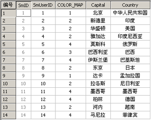
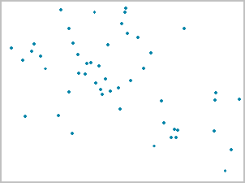

## 数据管理{#data-management}
### 数据集类型{#datasettype}
数据集是同种类型数据的集合，比如：点数据集、线数据集。数据集类（Dataset）是所有数据集类型的基类。根据数据类型的不同，分为矢量数据集、栅格数据集和影像数据集，以及为了处理特定问题而设计的如路由数据集，网络数据集等。按照数据结构不同，SuperMap中将数据集分为如下类型：点数据集（Point）、线数据集（Line）、面数据集(Region)、纯属性数据集（Tabular）、网络数据集（Network）、复合数据集（CAD）、文本数据集（Text）、路由数据集（LineM）、影像数据集（Image）、栅格数据集（Grid），其中点数据集、线数据集、面数据集、纯属性数据集、文本数据集、复合数据集属于矢量数据集类型。
数据集是SuperMap空间数据的基本组织单位之一。数据集是GIS数据组织的最小单位，一般一个数据集对应一个图层，即一个图层引用一个数据集的数据。一个数据源通常由多个不同类型的数据集组成。您可以根据自己的实际需要，或者按照数据集的特征、或者按照不同的使用目的来组织它们，把它们存放到不同的数据源中。
#### 矢量数据集{#vector-dataset}
存储和管理矢量数据的集合。在矢量数据模型中，现实世界中的实体用具有坐标意义的点、线、面表示，用拓扑描述矢量数据之间的关系。通常地，点、线、面和文本数据集都是属于矢量数据集的。
其中矢量数据集是由同种类型空间要素组成的集合，所以也可以称为要素集。根据要素的空间特征的不同，矢量数据集又分为点数据集，线数据集，面数据集等，空间特征和性质相同的数据组织在一个数据集中。
#### 纯属性数据集{#attribute-dataset}
纯属性数据集（Tabular）存储和管理纯属性数据的集合。纯属性数据集没有空间图形数据，即纯属性数据集不能作为图层被添加到地图窗口中显示。纯属性数据用来描述地形地物特征、形状等信息，如河流的长度、宽度等。一些社会经济数据、统计数据也可以作为纯属性信息。在SuperMap中，您可以把通过拼接（Joint 和 Link）等操作把纯属性数据集和其他矢量数据集连接起来，以便于进行相关操作。

#### 点数据集{#point-dataset}
点数据集只能用于存储点对象，如离散点的分布。

### 地图{#map}
地图（Map）是由一个或多个图层叠加而成，而图层是对数据集的引用，是采用设定的风格对数据集的显示，因而，一个或者多个数据集被赋予一定的显示风格而显示在一个SuperMap 地图窗口中，就成为地图。地图中定义了各图层的名称、显示风格、视野范围、图层状态和图层顺序等信息，保存地图时这些信息都将一起保存下来。

### 对象编辑{#edit-objects}

### 表和属性信息{#table-attribute-information}